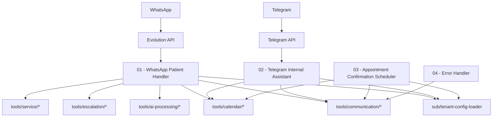
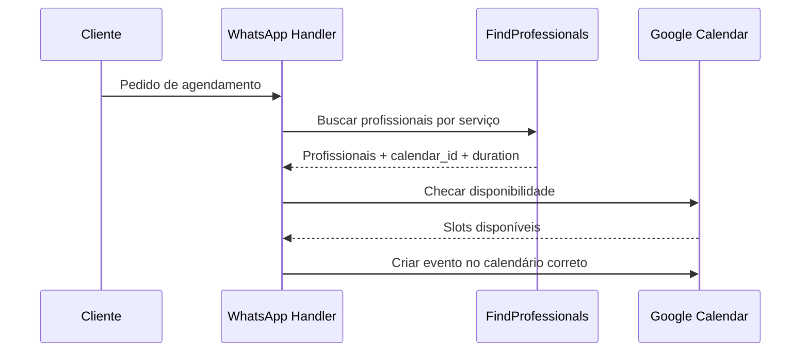

# 🏥 Sistema Multi-Agente para Gestão de Clínicas (v3.0)

> **Automação multi-tenant e multi-profissional com n8n**  
> **Baseado no Material Secretária v3** | **Workflows validados em `workflows/`**

[](LICENSE)
[]()
[]()

---

## 🎯 Visão Geral

Plataforma de automação para clínicas com fluxos de atendimento, agendamento e operações internas via n8n. Suporta **multi-tenant**, **multi-profissional** e **multi-serviço**, com integração a **WhatsApp**, **Telegram** e **Google Calendar**.

---

## ✅ O que existe nesta versão (validado em `workflows/`)

- Orquestradores principais em `workflows/main/`
- Sub-workflows em `workflows/sub/`
- Ferramentas em `workflows/tools/`:
  - Calendário (Google Calendar)
  - Comunicação (WhatsApp, Telegram)
  - IA e mídia (OCR e áudio)
  - Escalonamento humano
  - Catálogo/serviços

---

## 🧭 Visão Geral da Arquitetura



---

## 🗂️ Estrutura de Workflows

```
workflows/
├── main/   # Orquestradores principais
├── sub/    # Sub-workflows reutilizáveis
└── tools/  # Ferramentas para agentes
```

---

## 🤖 Workflows Principais (`workflows/main/`)

### 01 - WhatsApp Patient Handler (AI Optimized)
**Arquivo**: `workflows/main/01-whatsapp-patient-handler-optimized.json`  
**Função**: Atendimento e agendamento via WhatsApp com suporte a multi-profissional e multi-serviço.



### 02 - Telegram Internal Assistant (Multi-Tenant)
**Arquivo**: `workflows/main/02-telegram-internal-assistant-multitenant.json`  
**Função**: Assistente interno para equipe via Telegram.  
Inclui **lista de compras** com **Google Tasks** e reagendamentos com notificação ao paciente.

### 03 - Appointment Confirmation Scheduler
**Arquivo**: `workflows/main/03-appointment-confirmation-scheduler.json`  
**Função**: Lembretes diários de confirmação para consultas do dia seguinte.

### 04 - Error Handler
**Arquivo**: `workflows/main/04-error-handler.json`  
**Função**: Captura e registra erros globais e notifica via Telegram.

---

## 🛠️ Ferramentas (`workflows/tools/`)

### 📅 Calendário
- `google-calendar-availability-tool.json`
- `google-calendar-create-event-tool.json`
- `google-calendar-list-events-tool.json`

### 🗣️ Comunicação
- `whatsapp-send-tool.json`
- `telegram-notify-tool.json`
- `message-formatter-tool.json`

### 🧠 IA e Mídia
- `audio-transcription-tool.json`
- `image-ocr-tool.json`

### 🧑‍⚕️ Serviços
- `find-professionals-tool.json`

### 🧯 Escalonamento
- `call-to-human-tool.json`

---

## 🔐 Regras Críticas (Multi-Profissional)

1. **Sempre usar `google_calendar_id` retornado por `FindProfessionals`.**
2. **Sempre usar `duration_minutes` do profissional selecionado.**
3. Agendamentos e confirmações são por calendário de profissional.

---

## 🚀 Instalação (resumo)

1. `cp .env.example .env`
2. `docker compose up -d`
3. `./scripts/init-db.sh`
4. `./scripts/reimport-all-workflows.sh`

---

## 🔑 Google OAuth (coleta de dados para novos clientes)

Para cada novo tenant, voce precisa gerar e armazenar 3 valores no banco (tabela `calendars`):

- `google_client_id`
- `google_client_secret`
- `google_refresh_token`

### Passo a passo (Google Cloud Console)

1. Acesse [Google Cloud Console - Credentials](https://console.cloud.google.com/apis/credentials)
2. Selecione o projeto (ou crie um novo)
3. Em **APIs e Servicos > Biblioteca**, ative **Google Calendar API**
4. Volte em **Credentials** e clique em **Create Credentials > OAuth client ID**
5. Tipo: **Web application**
6. Em **Authorized redirect URIs**, adicione:

```
https://developers.google.com/oauthplayground
```

7. Salve e copie:
  - **Client ID** (termina com `apps.googleusercontent.com`)
  - **Client Secret**

### Passo a passo (OAuth 2.0 Playground)

1. Acesse [OAuth 2.0 Playground](https://developers.google.com/oauthplayground)
2. Clique na engrenagem (canto superior direito)
3. Marque **Use your own OAuth credentials**
4. Cole o **Client ID** e **Client Secret**
5. Em **Step 1**, selecione **Google Calendar API v3** e marque:

```
https://www.googleapis.com/auth/calendar
```

6. Clique **Authorize APIs** e faca login com o email do cliente
7. Clique **Exchange authorization code for tokens**
8. Copie o **Refresh Token** gerado

### Onde salvar no banco

Atualize a tabela `calendars` com os 3 campos acima para o `tenant_id` do cliente.
Sem `google_refresh_token`, o workflow **Google Calendar Client** nao retorna credenciais.

---

## 📚 Documentação (mantida)

- [Arquitetura](docs/ARCHITECTURE.md)
- [Guia do Usuário](docs/USER_GUIDE.md)
- [Implantação](docs/DEPLOYMENT.md)
- [Migração](docs/MIGRATION_GUIDE.md)
- [Configuração de Tipos de Clínica](docs/CLINIC_TYPE_CONFIGURATION.md)
- [Catálogo Dinâmico](docs/DYNAMIC_CATALOG_ARCHITECTURE.md)
- [Arquitetura Multi-Profissional](docs/MULTI_PROVIDER_ARCHITECTURE.md)
- [Service Resolver](docs/SERVICE_RESOLVER_ARCHITECTURE.md)
- [Setup Google Calendar API](docs/SETUP_GOOGLE_CALENDAR_API.md)
- [Alternativas MCP](docs/MCP_ALTERNATIVES.md)

---

## 🐛 Troubleshooting Rápido

- **Erro na importação**: `./scripts/reimport-all-workflows.sh`
- **Banco**: `docker compose ps` e confira `.env`
- **Evolution API**: webhook apontando para o n8n

Logs do n8n:
```bash
docker compose logs -f n8n
```

---

## 📄 Licença

Projeto proprietário. Consulte [LICENSE](LICENSE).