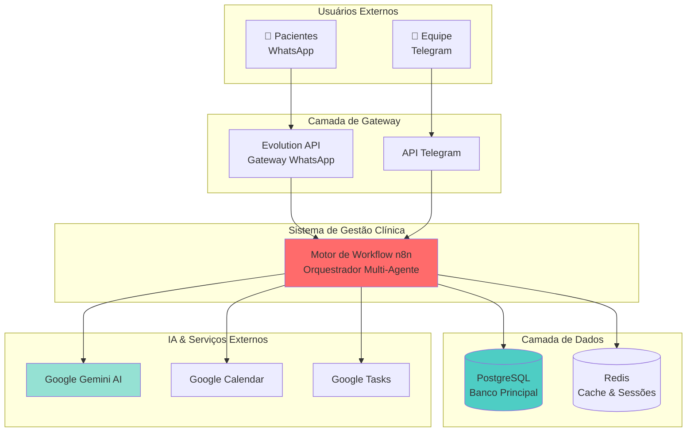
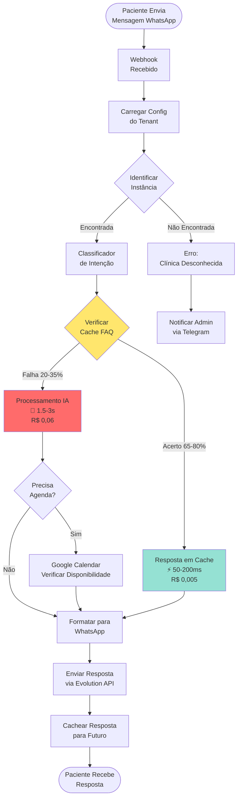
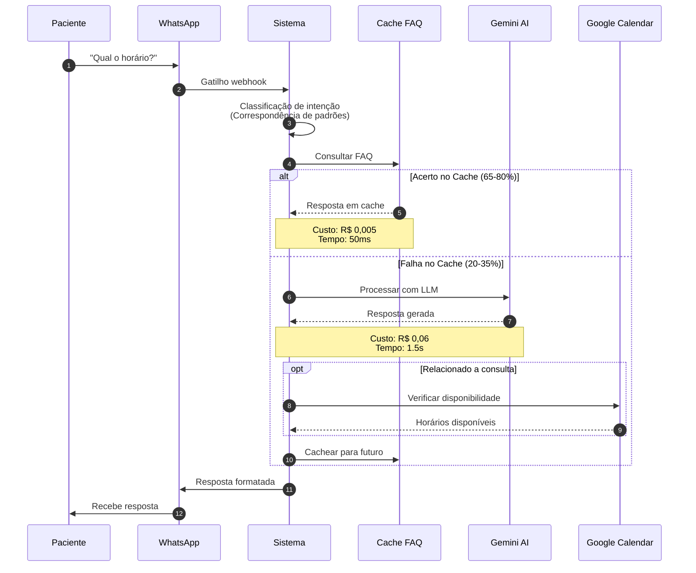

# 🏥 Sistema Multi-Agente para Gestão de Clínicas

> **Software de Nível Empresarial com IA para Automação em Clínicas de Saúde**  
> **Versão 1.0** | Copyright © 2026. Todos os Direitos Reservados.

[](LICENSE)
[]()
[](https://sua-empresa.com/suporte)

---

## 🎯 Visão Geral

O **Sistema Multi-Agente para Gestão de Clínicas** é uma plataforma de automação profissional e pronta para produção, projetada especificamente para clínicas de saúde. Oferece comunicação inteligente com pacientes via WhatsApp, ferramentas internas para equipe via Telegram e gerenciamento automatizado de consultas—tudo alimentado por tecnologia de IA de ponta.

### Principais Benefícios

- 💰 **Redução de 70-75% nos Custos** de processamento de IA através de cache inteligente
- ⚡ **Respostas 3-5x Mais Rápidas** para consultas comuns de pacientes
- 🤖 **Suporte Automatizado 24/7** sem intervenção humana
- 📊 **Análises em Tempo Real** e relatórios via Telegram
- 🔒 **Segurança Nível Empresarial** com isolamento multi-tenant
- 📈 **Escalável sem Esforço** de clínica única a operações multi-localização

---

## ✨ Funcionalidades

### Para Pacientes
- ✅ Agendamento de consultas em linguagem natural via WhatsApp
- ✅ Respostas instantâneas para perguntas comuns (horários, localização, preços)
- ✅ Confirmações automáticas de consultas e lembretes
- ✅ Transcrição de mensagens de voz
- ✅ Processamento de imagens (receitas, resultados de exames)
- ✅ Suporte multi-idioma (configurável)

### Para Equipe da Clínica
- ✅ Bot Telegram para operações internas
- ✅ Reagendamento e cancelamentos rápidos
- ✅ Relatórios diários automatizados e análises
- ✅ Gerenciamento de lista de compras via Google Tasks
- ✅ Escalonamento inteligente para casos complexos
- ✅ Notificações em tempo real

### Para Donos de Clínicas
- ✅ Gerenciamento de múltiplas clínicas em plataforma única
- ✅ Análises detalhadas de uso e rastreamento de custos
- ✅ Sistema de FAQ auto-aprendizado (melhora com o tempo)
- ✅ Comportamento de IA customizável por clínica
- ✅ Tratamento de dados em conformidade com LGPD/GDPR
- ✅ Opções de implantação white-label (Empresarial)

---

## 🏗️ Arquitetura

### Visão Geral do Sistema



### Fluxo de Processamento de Mensagens



### Arquitetura de Otimização de IA

Nosso **Otimizador de Custo de IA** proprietário reduz custos de processamento em 70-75% sem sacrificar qualidade:



---

## 📊 Métricas de Desempenho

### Comparação de Custos

| Métrica | IA Tradicional | Nosso Sistema | Economia |
|---------|---------------|---------------|----------|
| **Custo por Mensagem** | R$ 0,075 | R$ 0,02 | **73%** |
| **Custo Mensal** (5k msgs) | R$ 1.000 | R$ 300 | **R$ 700** |
| **Custo Anual** (5k msgs) | R$ 12.000 | R$ 3.600 | **R$ 8.400** |
| **10 Clínicas Anual** | R$ 120.000 | R$ 36.000 | **R$ 84.000** |

### Tempo de Resposta

| Tipo de Consulta | Tempo de Resposta | % das Consultas |
|------------------|-------------------|-----------------|
| **FAQ em Cache** | 50-200ms | 65-80% |
| **IA Simples** | 500-1.000ms | 10-15% |
| **Complexa (Agenda)** | 1.500-3.000ms | 5-20% |
| **Média** | **500-800ms** | 100% |

**Sistemas Tradicionais**: tempo médio de resposta 2.500-4.000ms

---

## 🚀 Início Rápido

### Pré-requisitos

- **Servidor**: 4 vCPU, 8GB RAM, 50GB SSD
- **SO**: Ubuntu 22.04 LTS ou Debian 11+
- **Docker**: 20.10+ com Docker Compose
- **Serviços Externos**:
  - Projeto Google Cloud (APIs Gemini AI + Calendar + Tasks)
  - Instância Evolution API (gateway WhatsApp)
  - Token do bot Telegram

### Instalação (5 Minutos)

```bash
# 1. Clonar repositório (requer licença)
git clone https://sua-empresa.com/clinic-multi-agent.git
cd clinic-multi-agent

# 2. Configurar ambiente
cp env.example .env
nano .env  # Adicionar suas credenciais

# 3. Inicializar banco de dados
docker compose up -d postgres
./scripts/init-db.sh

# 4. Iniciar todos os serviços
docker compose up -d

# 5. Acessar interface n8n
# Navegador: https://seu-dominio.com:5678
# Login com credenciais do .env
```

### Configuração do Primeiro Tenant

```bash
# Criação interativa de tenant
./scripts/manage-tenants.sh add

# Ou usar SQL diretamente (ver docs/USER_GUIDE.md)
```

**Guia completo de implantação**: Veja [`docs/DEPLOYMENT.md`](docs/DEPLOYMENT.md)

---

## 📚 Documentação

| Documento | Descrição | Público |
|-----------|-----------|---------|
| **[Guia de Arquitetura](docs/ARCHITECTURE.md)** | Visão técnica, diagramas, pilha tecnológica | Engenheiros, Arquitetos |
| **[Guia de Implantação](docs/DEPLOYMENT.md)** | Configuração de produção passo a passo | DevOps, Equipes de TI |
| **[Guia do Usuário](docs/USER_GUIDE.md)** | Operações diárias, gerenciamento de FAQ | Gerentes, Equipe |
| **[LICENÇA](LICENSE)** | Termos da licença proprietária | Jurídico, Compras |

---

## 🛠️ Stack Tecnológico

| Componente | Tecnologia | Propósito |
|------------|-----------|-----------|
| **Orquestração** | n8n | Automação de workflow & agentes IA |
| **Banco de Dados** | PostgreSQL 14+ | Dados multi-tenant & configurações |
| **Cache** | Redis 7+ | Gerenciamento de sessão & performance |
| **IA/LLM** | Google Gemini 2.0 Flash | Processamento de linguagem natural |
| **WhatsApp** | Evolution API | Gateway de mensagens |
| **Agenda** | Google Calendar + MCP | Agendamento de consultas |
| **Infraestrutura** | Docker Compose | Orquestração de containers |

---

## 💼 Licenciamento

Este é um **software comercial proprietário**. Uso, cópia, modificação ou distribuição não autorizados são **estritamente proibidos** e sujeitos a ação legal.

### Licenças Disponíveis

| Tipo de Licença | Preço | Instâncias | Tenants | Suporte |
|-----------------|-------|------------|---------|---------|
| **Instância Única** | Consultar Vendas | 1 | Até 5 | Email (48h) |
| **Multi-Instância** | Consultar Vendas | Até 5 | Até 25 | Prioritário (24h) |
| **Empresarial** | Consultar Vendas | Ilimitado | Ilimitado | 24/7 Dedicado |

**Para adquirir uma licença**:
- 📧 Email: vendas@sua-empresa.com
- 📞 Telefone: +55 11 XXXX-XXXX
- 🌐 Web: https://sua-empresa.com/precos

**Termos completos da licença**: Veja [LICENÇA](LICENSE)

---

## 🔒 Segurança & Conformidade

### Proteção de Dados

- ✅ **Criptografia em Repouso**: PostgreSQL com volumes criptografados
- ✅ **Criptografia em Trânsito**: TLS 1.3 para todas comunicações API
- ✅ **Gerenciamento de Credenciais**: Cofre criptografado n8n com AES-256
- ✅ **Isolamento Multi-Tenant**: Segregação de dados nível banco
- ✅ **Log de Auditoria**: Trilhas completas de atividade por tenant

### Conformidade

- ✅ **LGPD** (Brasil): Minimização de dados, direito ao esquecimento, rastreamento de consentimento
- ✅ **GDPR** (Europa): Portabilidade de dados, trilhas de auditoria, privacidade por design
- ✅ **HIPAA** (EUA): Diretrizes de tratamento de PHI (configuração necessária)

**Relatório de auditoria de segurança**: Disponível para clientes licenciados

---

## 📈 Roadmap

### Versão 1.1 (2º Trimestre 2026)

- [ ] Dashboard de análises aprimorado
- [ ] Suporte multi-idioma (PT, EN, ES)
- [ ] Lógica avançada de agendamento (intervalos, pausas)
- [ ] App mobile para equipe da clínica

### Versão 2.0 (4º Trimestre 2026)

- [ ] Integração de chamadas de voz
- [ ] Recomendações de consultas com IA
- [ ] Pontuação de satisfação do paciente
- [ ] Suite avançada de relatórios

**Solicitações de recursos**: Contate seu gerente de conta ou suporte@sua-empresa.com

---

## 🤝 Suporte

### Para Clientes Licenciados

| Canal | Tempo de Resposta | Disponibilidade |
|-------|-------------------|-----------------|
| **Email** | 24-48h | Horário comercial |
| **Portal de Suporte** | 24-48h | Envio 24/7 |
| **Telefone** (Empresarial) | 4h | Horário comercial |
| **Emergência** (Empresarial) | 1h | 24/7 |

**Contato**: suporte@sua-empresa.com  
**Portal**: https://suporte.sua-empresa.com  
**Telefone**: +55 11 XXXX-XXXX

### Base de Conhecimento

- 📖 [Documentação Completa](docs/)
- 🎥 Tutoriais em Vídeo (apenas clientes licenciados)
- 💬 Fórum Privado da Comunidade (apenas Empresarial)
- 🎓 Webinars de Treinamento (mensais)

---

## ❓ Perguntas Frequentes

### O código-fonte é fornecido?

Arquivos JSON de workflow são fornecidos. Plataforma base (n8n, PostgreSQL) é open-source. Nossos workflows proprietários e documentação são licenciados.

### Posso usar white-label para meus clientes?

Sim, apenas com **Licença Empresarial**. Licenças Única e Multi-Instância são para uso interno.

### O que acontece se eu não renovar?

- ✅ Software continua funcionando
- ❌ Sem atualizações ou patches de segurança
- ❌ Sem acesso a suporte
- ❌ Sem novos recursos

### Posso modificar os workflows?

- ✅ Alterações de configuração (prompts, agendas)
- ✅ Adicionar FAQs customizados
- ❌ Modificar lógica central para revenda

### Vocês oferecem desenvolvimento customizado?

Sim! Clientes Empresariais recebem horas de customização. Contate vendas para projetos sob encomenda.

---

## 📞 Contato

**Vendas & Licenciamento**  
📧 vendas@sua-empresa.com  
📞 +55 11 XXXX-XXXX  
🌐 https://sua-empresa.com

**Suporte Técnico**  
📧 suporte@sua-empresa.com  
🎫 https://suporte.sua-empresa.com

**Parcerias**  
📧 parcerias@sua-empresa.com

---

## 📄 Jurídico

**Copyright © 2026 [Nome da Sua Empresa]. Todos os Direitos Reservados.**

Este software é protegido por leis de direitos autorais e tratados internacionais. Reprodução ou distribuição não autorizadas podem resultar em penalidades civis e criminais severas, e serão processadas na máxima extensão possível sob a lei.

**Marcas Registradas**: Todos os nomes de produtos, logos e marcas são propriedade de seus respectivos donos.

---

**Versão**: 1.0.0  
**Data de Lançamento**: 1º de Janeiro, 2026  
**Última Atualização**: 1º de Janeiro, 2026

---

<p align="center">
  <strong>🏥 Sistema Multi-Agente para Gestão de Clínicas</strong><br/>
  <em>O Futuro da Automação em Saúde</em>
</p>

<p align="center">
  <a href="https://sua-empresa.com">Website</a> •
  <a href="docs/DEPLOYMENT.md">Documentação</a> •
  <a href="LICENSE">Licença</a> •
  <a href="https://sua-empresa.com/precos">Preços</a>
</p>
