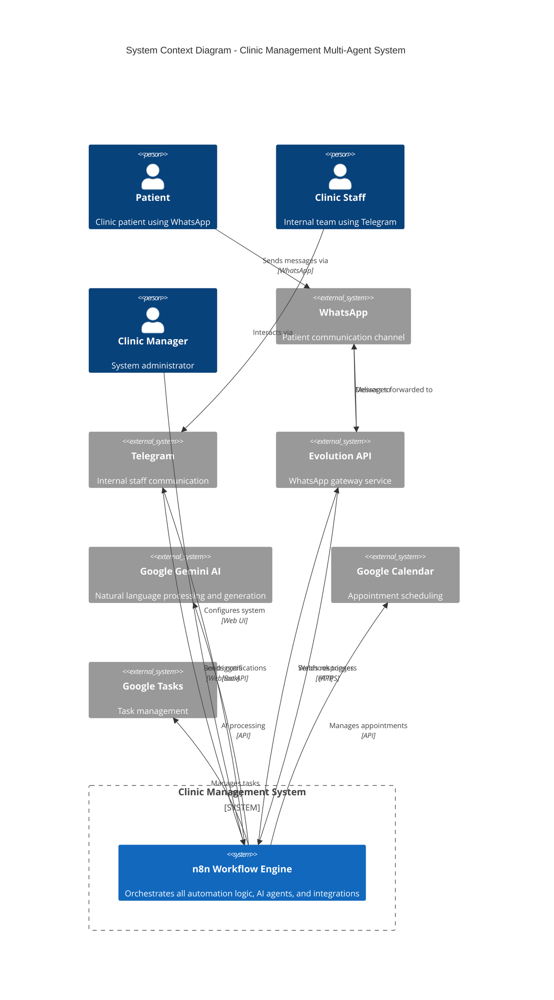
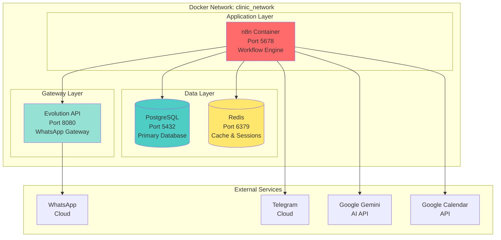
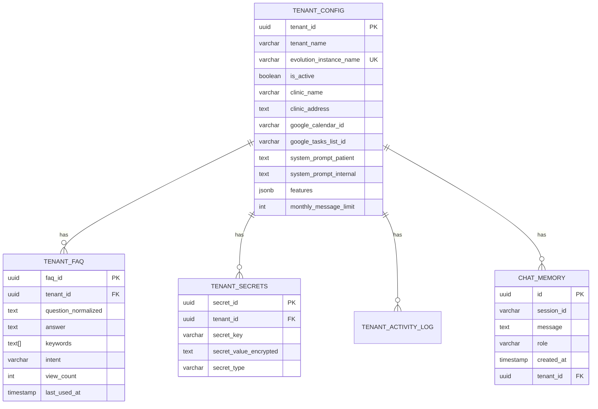
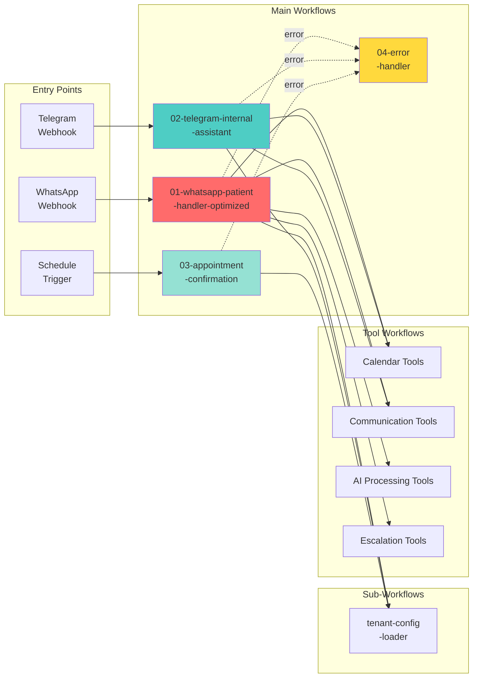
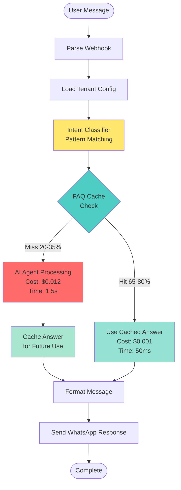
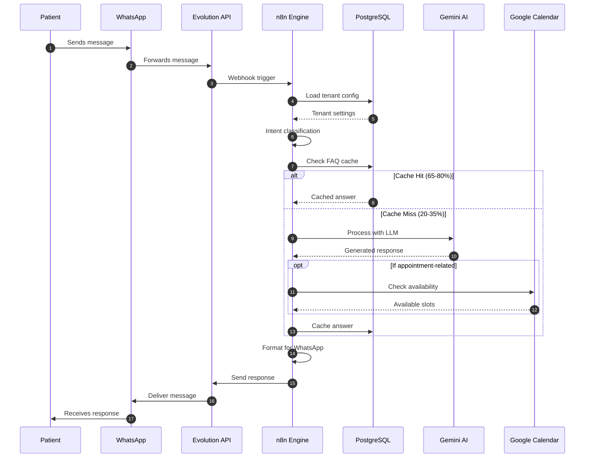
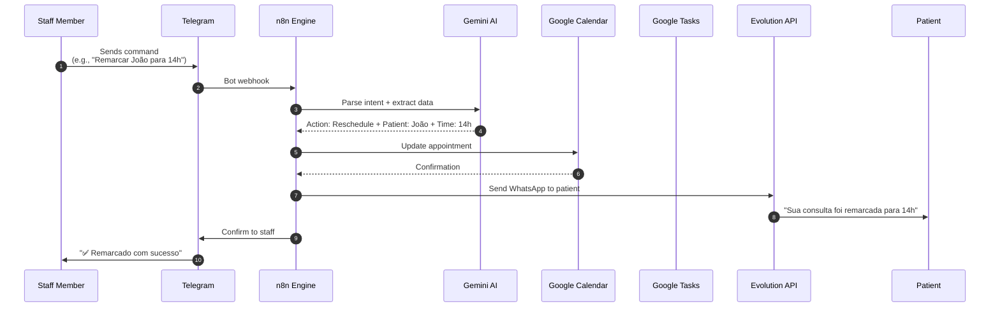
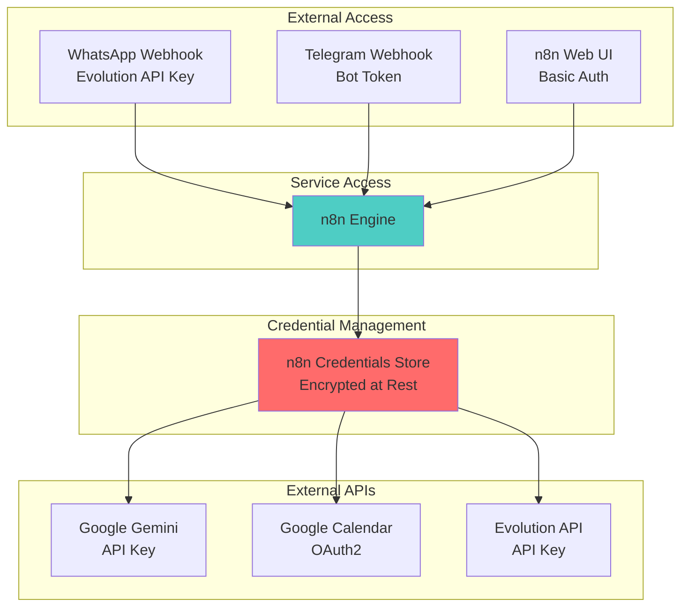
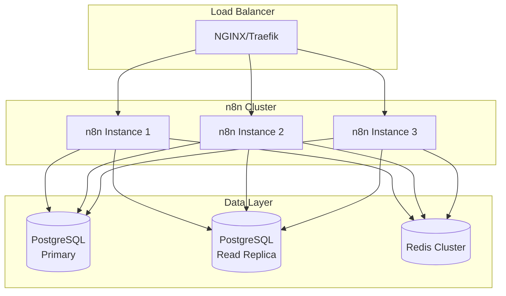
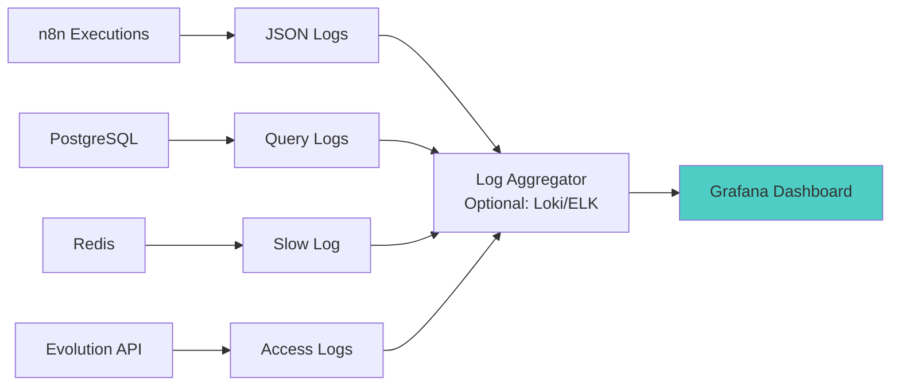

# System Architecture

> **Proprietary Documentation**  
> Copyright © 2026. All Rights Reserved.  
> This document is confidential and intended for authorized clients only.

---

## Overview

The **Clinic Management Multi-Agent System** is a containerized, AI-powered automation platform designed for healthcare clinics. It provides intelligent patient communication via WhatsApp, internal staff tools via Telegram, and automated appointment management—all orchestrated through n8n workflows.

---

## Technology Stack

### Core Components

| Component | Technology | Version | Purpose |
|-----------|-----------|---------|---------|
| **Orchestration Engine** | n8n | latest | Workflow automation and AI agent orchestration |
| **Database** | PostgreSQL | 14+ | Persistent storage for configurations, chat history, FAQ cache |
| **Cache Layer** | Redis | 7+ | Session management and performance optimization |
| **WhatsApp Gateway** | Evolution API | latest | WhatsApp message sending/receiving |
| **AI/LLM** | Google Gemini 2.0 Flash | latest | Natural language understanding and generation |
| **Calendar** | Google Calendar + MCP | - | Appointment scheduling and availability |
| **Containerization** | Docker Compose | - | Multi-container orchestration |

---

## C4 Context Diagram

The following diagram illustrates how the system interacts with external actors and services:



---

## Container Architecture



---

## Data Architecture

### Database Schema Overview



### Multi-Tenant Isolation Strategy

1. **Configuration Isolation**: Each tenant has a unique `tenant_id` and `evolution_instance_name`
2. **Data Isolation**: All queries filtered by `tenant_id` via tenant-config-loader sub-workflow
3. **Memory Isolation**: Chat sessions prefixed with `{tenant_id}_{user_phone}`
4. **FAQ Isolation**: FAQ cache scoped per tenant with dedicated indexes
5. **Optional**: Row-Level Security (RLS) policies for additional database-level isolation

---

## Workflow Architecture

### Main Workflows



### AI Optimization Layer

The system includes an intelligent routing mechanism that reduces AI API costs by 70-75%:



**Cost Impact**:
- **Before Optimization**: $0.015 per message (2 AI calls)
- **After Optimization**: $0.004 per message average (0.3 AI calls)
- **Savings**: 70-75% reduction in AI costs

---

## Message Flow

### Patient Communication Flow



### Internal Staff Flow



---

## Security Architecture

### Authentication & Authorization



### Data Protection

1. **Encryption at Rest**: PostgreSQL with encrypted volumes
2. **Encryption in Transit**: HTTPS/TLS for all external API calls
3. **Credential Storage**: n8n encrypted credentials vault
4. **Secret Management**: Optional `tenant_secrets` table with encrypted values
5. **Network Isolation**: Docker internal network, only necessary ports exposed
6. **Access Control**: Evolution API instance name acts as tenant identifier

---

## Scalability Considerations

### Current Architecture

- **Single-Server Deployment**: All containers on one host
- **Vertical Scaling**: Increase CPU/RAM for n8n container
- **Database**: Single PostgreSQL instance with connection pooling

### Scale-Out Strategy (Future)



**Current Capacity** (Single Server - 4 vCPU, 8GB RAM):
- ~10-20 tenants
- ~50,000 messages/month total
- ~100 concurrent conversations

**Recommended Scaling Triggers**:
- CPU usage > 70% sustained
- Database connections > 80% of pool
- Response time > 3s P95
- More than 20 active tenants

---

## Monitoring & Observability

### Key Metrics

| Metric | Target | Alert Threshold |
|--------|--------|----------------|
| Response Time (P95) | < 2s | > 5s |
| Error Rate | < 1% | > 5% |
| FAQ Cache Hit Rate | > 60% | < 40% |
| AI API Cost/Message | < $0.005 | > $0.015 |
| Database Connection Pool | < 80% | > 90% |
| Disk Usage | < 70% | > 85% |

### Logging Strategy



---

## Disaster Recovery

### Backup Strategy

1. **Database**: Automated daily backups via `pg_dump`
2. **n8n Data**: Volume snapshots of `/home/node/.n8n`
3. **Environment Configs**: `.env` file backup
4. **Retention**: 7 daily, 4 weekly, 12 monthly

### Recovery Procedure

```bash
# 1. Restore database
psql $DATABASE_URL < backup_YYYYMMDD.sql

# 2. Restore n8n data
docker cp backup_n8n_data.tar n8n:/home/node/.n8n

# 3. Restart services
docker-compose restart

# 4. Verify health
curl http://localhost:5678/healthz
```

**Recovery Time Objective (RTO)**: < 1 hour  
**Recovery Point Objective (RPO)**: < 24 hours

---

## Performance Optimization

### Database Indexes

All critical query paths are indexed:
- `tenant_config.evolution_instance_name` (unique)
- `tenant_faq.tenant_id, question_normalized` (composite)
- `tenant_faq.keywords` (GIN index for array matching)
- `langchain_pg_memory.tenant_id, session_id` (composite)

### Caching Strategy

1. **FAQ Cache**: PostgreSQL-backed (persistent)
2. **Session Data**: Redis (ephemeral)
3. **Tenant Config**: Loaded per workflow execution (minimal overhead)

### Query Optimization

- Tenant config: Single query with all fields (1 DB hit)
- FAQ lookup: Indexed query with ILIKE (< 5ms)
- Chat memory: Window-based retrieval (last 5 messages)

---

## Technology Choices - Rationale

| Decision | Rationale |
|----------|-----------|
| **n8n vs Zapier** | Self-hosted, no per-execution cost, full workflow control, AI agent support |
| **PostgreSQL vs MongoDB** | ACID compliance critical for appointments, strong indexing, jsonb for flexibility |
| **Redis vs Memcached** | Richer data structures, persistence options, pub/sub capabilities |
| **Evolution API vs Twilio** | WhatsApp Cloud API support, self-hosted option, Brazil-friendly |
| **Gemini vs OpenAI** | Lower cost, faster responses, multimodal support (vision + audio) |
| **Docker Compose vs Kubernetes** | Simpler operations, sufficient for 10-20 tenant scale, lower overhead |

---

## Compliance & Data Privacy

### LGPD/GDPR Considerations

1. **Data Minimization**: Only essential patient data stored
2. **Right to Erasure**: Cascade delete on tenant removal
3. **Data Portability**: PostgreSQL dump per tenant
4. **Consent Management**: Tracked via WhatsApp opt-in
5. **Audit Trail**: `tenant_activity_log` table

### PHI/PII Handling

- **Patient Names**: Stored in chat memory (encrypted at rest)
- **Phone Numbers**: Hashed for session keys
- **Medical Data**: NOT stored (appointment metadata only)
- **Location**: Clinic address only (no patient addresses)

---

## Support & Maintenance

### Update Strategy

1. **n8n Updates**: Monthly review, staging test, production deploy
2. **Workflow Updates**: Versioned via git, deployed via import
3. **Database Migrations**: Incremental scripts in `scripts/migrations/`
4. **Dependency Updates**: Quarterly security patches

### Health Checks

```bash
# n8n health
curl http://localhost:5678/healthz

# PostgreSQL
docker exec clinic_postgres pg_isready

# Redis
docker exec clinic_redis redis-cli ping

# Evolution API
curl http://localhost:8080/instance/connectionState/clinic_instance
```

---

**Document Version**: 1.0  
**Last Updated**: 2026-01-01  
**Classification**: Proprietary & Confidential
