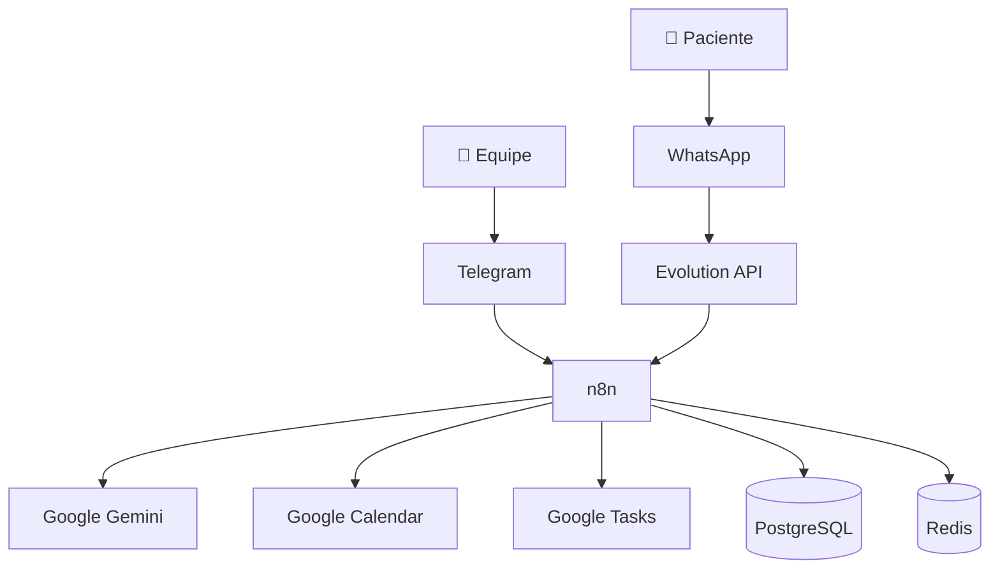
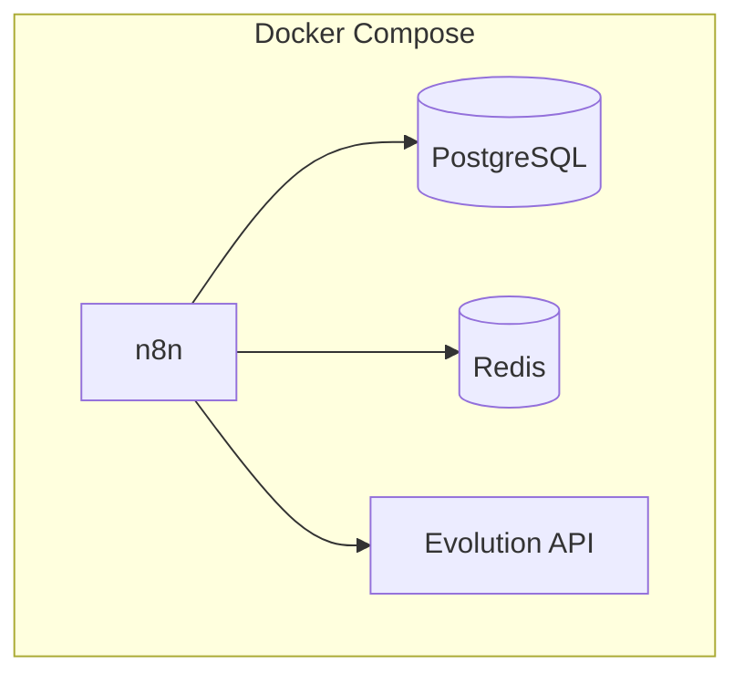
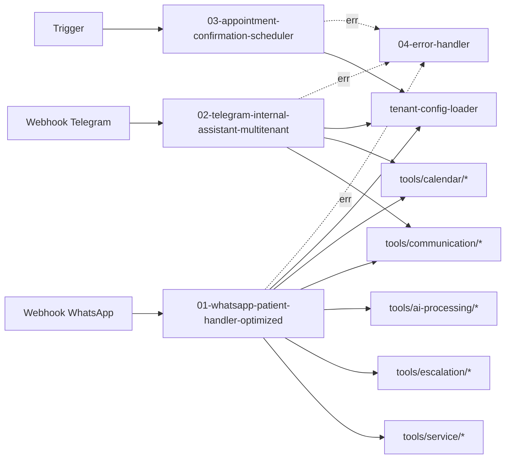
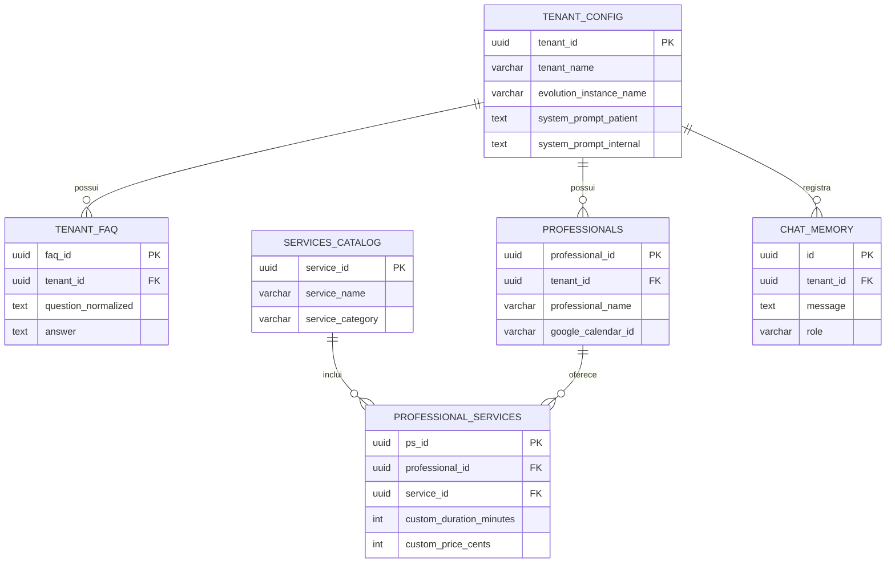
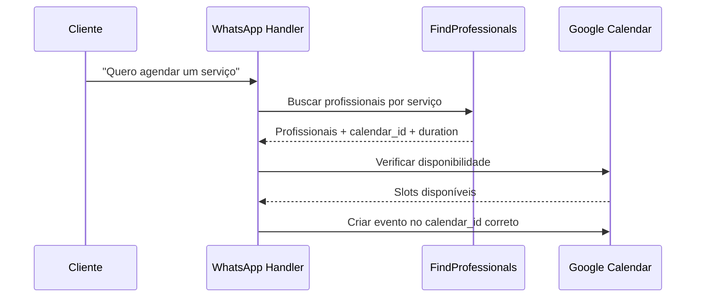

# Arquitetura do Sistema

> **Documentação Proprietária**  
> Copyright © 2026. Todos os Direitos Reservados.  
> Este documento é confidencial e destinado apenas a clientes autorizados.

---

## Visão Geral

O **Sistema Multi-Agente de Gestão de Clínicas** é uma plataforma de automação via **n8n**, com atendimento a pacientes por **WhatsApp** e operações internas via **Telegram**. O sistema é **multi-tenant**, **multi-profissional** e **multi-serviço**, com agendamentos por **Google Calendar**.

---

## Stack Tecnológico

| Componente | Tecnologia | Propósito |
|------------|------------|-----------|
| Orquestração | n8n | Workflows e agentes |
| Banco | PostgreSQL | Configurações, catálogos, FAQs |
| Cache | Redis | Sessões e otimizações |
| WhatsApp Gateway | Evolution API | Mensagens e webhooks |
| IA | Google Gemini | Processamento de linguagem |
| Calendário | Google Calendar | Agendamentos |
| Contêiner | Docker Compose | Execução local/servidor |

---

## Diagrama de Contexto

---

## Arquitetura de Containers

---

## Arquitetura de Workflows

---

## Modelo de Dados (alto nível)

---

## Fluxo de Agendamento (multi-profissional)

---

## Componentes de Ferramentas

- **Calendário**: disponibilidade, criação e listagem de eventos.
- **Comunicação**: envio WhatsApp/Telegram e formatação de mensagens.
- **IA e Mídia**: transcrição de áudio e OCR de imagem.
- **Escalonamento**: encaminhamento ao atendimento humano.
- **Serviços**: busca de profissionais por serviço.

---

## Segurança e Isolamento

- Isolamento por **tenant_id** em banco e workflows.
- Credenciais centralizadas e criptografadas no n8n.
- Calendários isolados por profissional (`google_calendar_id`).

---

**Última Atualização**: 2026-01-24  
**Versão**: 3.0