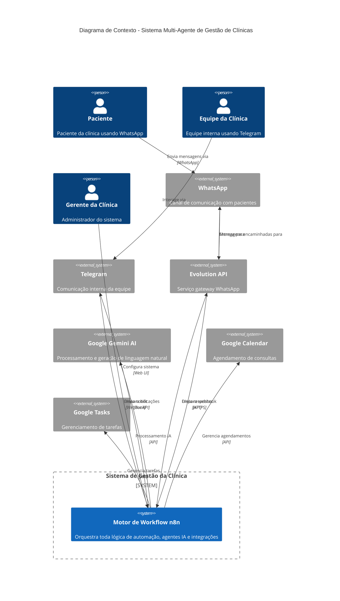
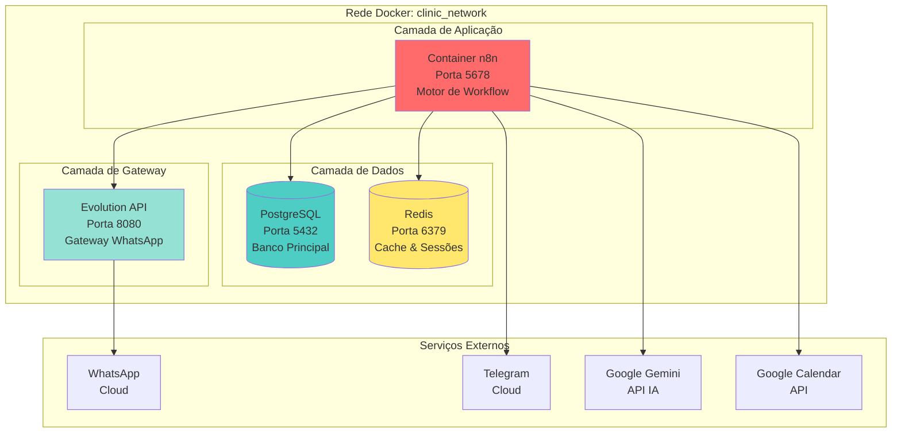
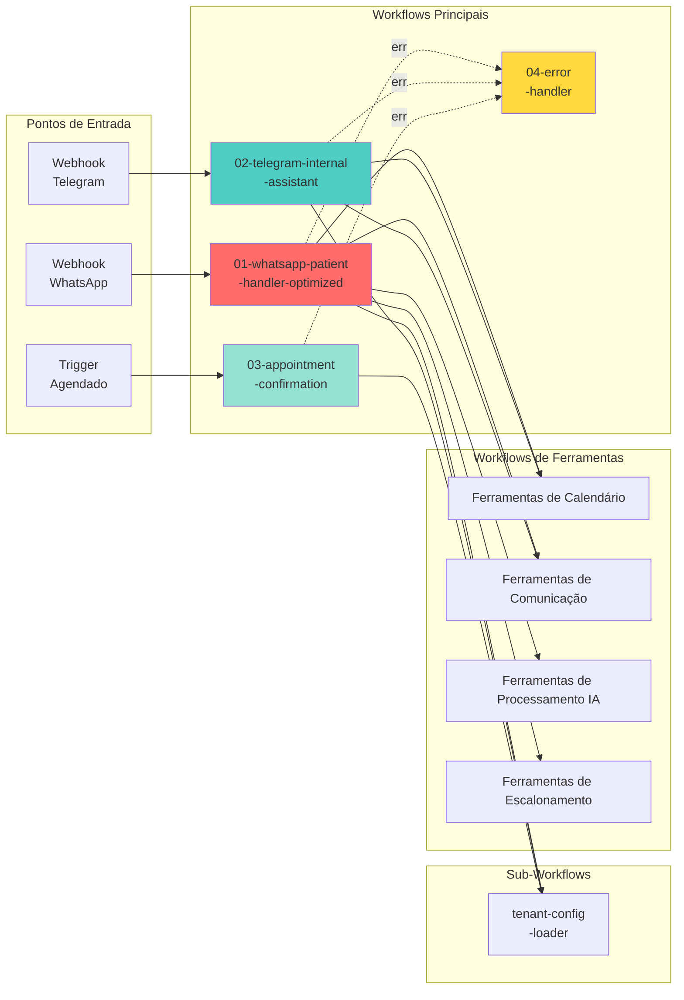
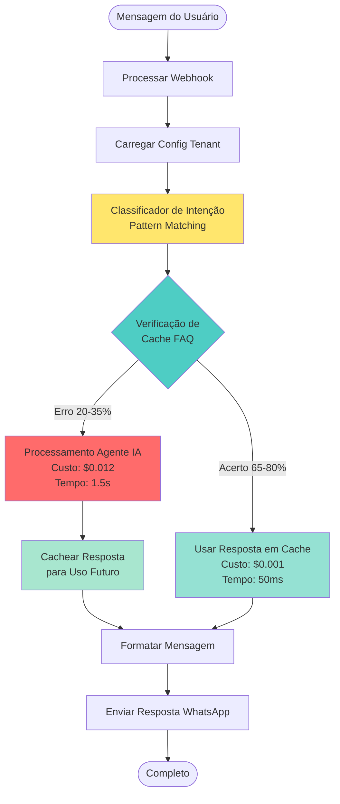
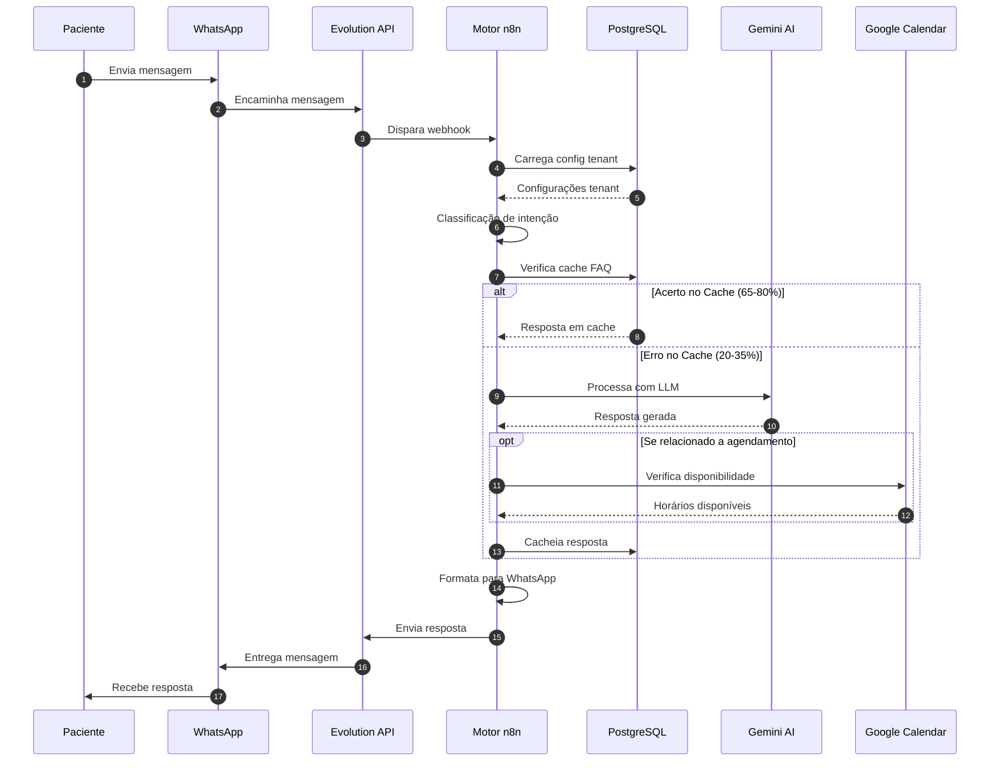
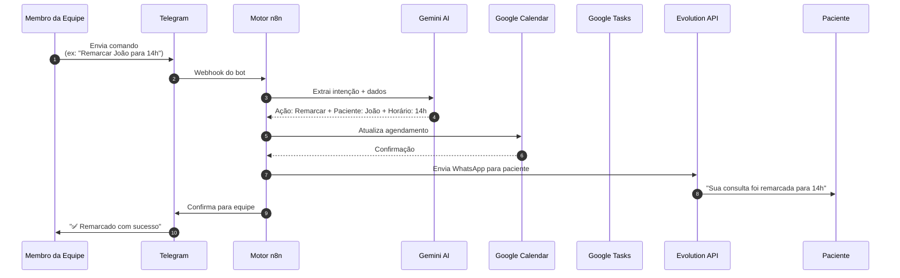
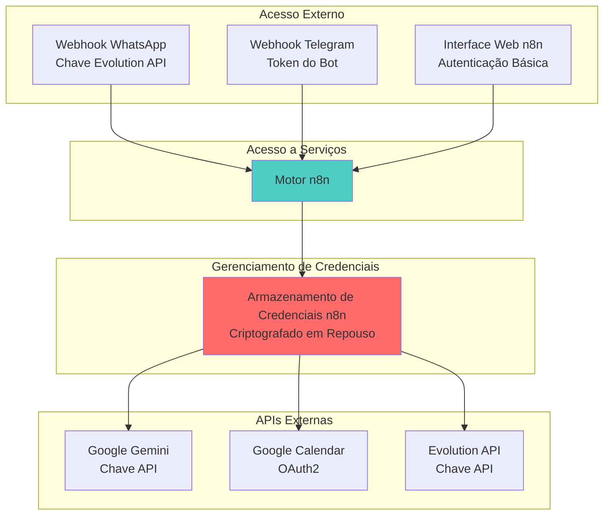
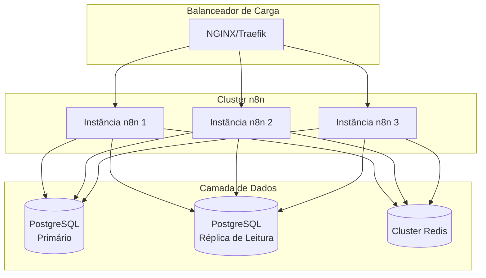
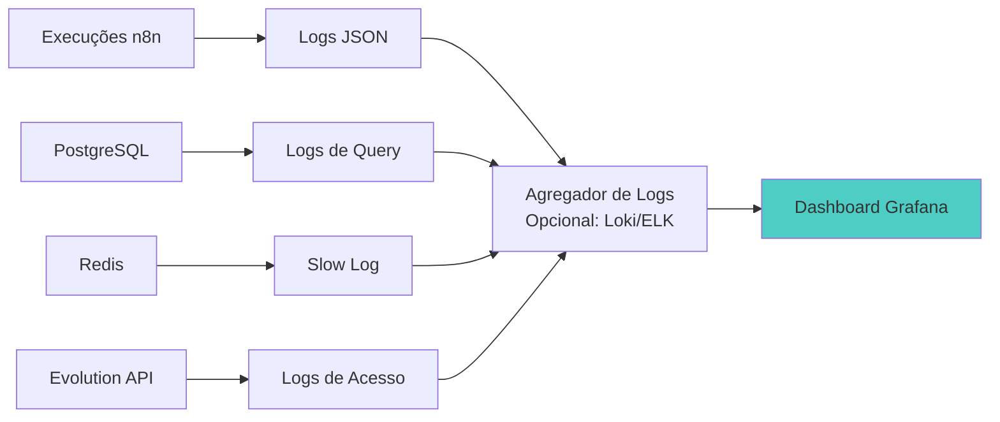

# Arquitetura do Sistema

> **Documentação Proprietária**  
> Copyright © 2026. Todos os Direitos Reservados.  
> Este documento é confidencial e destinado apenas a clientes autorizados.

---

## Visão Geral

O **Sistema Multi-Agente de Gestão de Clínicas** é uma plataforma de automação containerizada e alimentada por IA, projetada para clínicas de saúde. Ele fornece comunicação inteligente com pacientes via WhatsApp, ferramentas internas para a equipe via Telegram e gerenciamento automatizado de agendamentos—tudo orquestrado através de workflows n8n.

---

## Stack Tecnológico

### Componentes Principais

| Componente | Tecnologia | Versão | Propósito |
|------------|------------|--------|-----------|
| **Motor de Orquestração** | n8n | latest | Automação de workflows e orquestração de agentes IA |
| **Banco de Dados** | PostgreSQL | 14+ | Armazenamento persistente para configurações, histórico de chat, cache de FAQ |
| **Camada de Cache** | Redis | 7+ | Gerenciamento de sessões e otimização de performance |
| **Gateway WhatsApp** | Evolution API | latest | Envio/recebimento de mensagens WhatsApp |
| **IA/LLM** | Google Gemini 2.0 Flash | latest | Compreensão e geração de linguagem natural |
| **Calendário** | Google Calendar + MCP | - | Agendamento e disponibilidade de consultas |
| **Containerização** | Docker Compose | - | Orquestração multi-container |

---

## Diagrama de Contexto C4

O diagrama a seguir ilustra como o sistema interage com atores externos e serviços:



---

## Arquitetura de Containers



---

## Arquitetura de Dados

### Visão Geral do Schema do Banco


### Estratégia de Isolamento Multi-Tenant

1. **Isolamento de Configuração**: Cada tenant possui um `tenant_id` e `evolution_instance_name` únicos
2. **Isolamento de Dados**: Todas as consultas filtradas por `tenant_id` via sub-workflow tenant-config-loader
3. **Isolamento de Memória**: Sessões de chat prefixadas com `{tenant_id}_{telefone_usuario}`
4. **Isolamento de FAQ**: Cache de FAQ com escopo por tenant com índices dedicados
5. **Opcional**: Políticas Row-Level Security (RLS) para isolamento adicional em nível de banco

---

## Arquitetura de Workflows

### Workflows Principais



### Camada de Otimização de IA

O sistema inclui um mecanismo de roteamento inteligente que reduz custos de API de IA em 70-75%:



**Impacto nos Custos**:
- **Antes da Otimização**: $0.015 por mensagem (2 chamadas IA)
- **Após Otimização**: $0.004 por mensagem em média (0.3 chamadas IA)
- **Economia**: Redução de 70-75% nos custos de IA

---

## Fluxo de Mensagens

### Fluxo de Comunicação com Paciente



### Fluxo da Equipe Interna



---

## Arquitetura de Segurança

### Autenticação e Autorização



### Proteção de Dados

1. **Criptografia em Repouso**: PostgreSQL com volumes criptografados
2. **Criptografia em Trânsito**: HTTPS/TLS para todas as chamadas de API externas
3. **Armazenamento de Credenciais**: Cofre de credenciais criptografadas do n8n
4. **Gerenciamento de Secrets**: Tabela `tenant_secrets` opcional com valores criptografados
5. **Isolamento de Rede**: Rede interna Docker, apenas portas necessárias expostas
6. **Controle de Acesso**: Nome da instância Evolution API atua como identificador do tenant

---

## Considerações de Escalabilidade

### Arquitetura Atual

- **Implantação em Servidor Único**: Todos os containers em um host
- **Escalamento Vertical**: Aumentar CPU/RAM para container n8n
- **Banco de Dados**: Instância única PostgreSQL com connection pooling

### Estratégia de Scale-Out (Futuro)



**Capacidade Atual** (Servidor Único - 4 vCPU, 8GB RAM):
- ~10-20 tenants
- ~50.000 mensagens/mês total
- ~100 conversas simultâneas

**Gatilhos de Escalamento Recomendados**:
- Uso de CPU > 70% sustentado
- Conexões de banco > 80% do pool
- Tempo de resposta > 3s P95
- Mais de 20 tenants ativos

---

## Monitoramento e Observabilidade

### Métricas Principais

| Métrica | Meta | Limiar de Alerta |
|---------|------|------------------|
| Tempo de Resposta (P95) | < 2s | > 5s |
| Taxa de Erro | < 1% | > 5% |
| Taxa de Acerto Cache FAQ | > 60% | < 40% |
| Custo API IA/Mensagem | < $0.005 | > $0.015 |
| Pool de Conexões do Banco | < 80% | > 90% |
| Uso de Disco | < 70% | > 85% |

### Estratégia de Logs



---

## Recuperação de Desastres

### Estratégia de Backup

1. **Banco de Dados**: Backups diários automatizados via `pg_dump`
2. **Dados n8n**: Snapshots de volume de `/home/node/.n8n`
3. **Configurações de Ambiente**: Backup do arquivo `.env`
4. **Retenção**: 7 diários, 4 semanais, 12 mensais

### Procedimento de Recuperação

```bash
# 1. Restaurar banco de dados
psql $DATABASE_URL < backup_YYYYMMDD.sql

# 2. Restaurar dados n8n
docker cp backup_n8n_data.tar n8n:/home/node/.n8n

# 3. Reiniciar serviços
docker-compose restart

# 4. Verificar saúde
curl http://localhost:5678/healthz
```

**Objetivo de Tempo de Recuperação (RTO)**: < 1 hora  
**Objetivo de Ponto de Recuperação (RPO)**: < 24 horas

---

## Otimização de Performance

### Índices do Banco de Dados

Todos os caminhos críticos de consulta são indexados:
- `tenant_config.evolution_instance_name` (único)
- `tenant_faq.tenant_id, question_normalized` (composto)
- `tenant_faq.keywords` (índice GIN para correspondência de array)
- `langchain_pg_memory.tenant_id, session_id` (composto)

### Estratégia de Cache

1. **Cache FAQ**: Baseado em PostgreSQL (persistente)
2. **Dados de Sessão**: Redis (efêmero)
3. **Config Tenant**: Carregada por execução de workflow (overhead mínimo)

### Otimização de Queries

- Config tenant: Query única com todos os campos (1 acesso ao banco)
- Busca FAQ: Query indexada com ILIKE (< 5ms)
- Memória de chat: Recuperação baseada em janela (últimas 5 mensagens)

---

## Escolhas Tecnológicas - Justificativas

| Decisão | Justificativa |
|---------|---------------|
| **n8n vs Zapier** | Self-hosted, sem custo por execução, controle total de workflow, suporte a agente IA |
| **PostgreSQL vs MongoDB** | Conformidade ACID crítica para agendamentos, indexação forte, jsonb para flexibilidade |
| **Redis vs Memcached** | Estruturas de dados mais ricas, opções de persistência, capacidades pub/sub |
| **Evolution API vs Twilio** | Suporte a WhatsApp Cloud API, opção self-hosted, compatível com Brasil |
| **Gemini vs OpenAI** | Menor custo, respostas mais rápidas, suporte multimodal (visão + áudio) |
| **Docker Compose vs Kubernetes** | Operações mais simples, suficiente para escala de 10-20 tenants, menor overhead |

---

## Conformidade e Privacidade de Dados

### Considerações LGPD/GDPR

1. **Minimização de Dados**: Apenas dados essenciais de pacientes armazenados
2. **Direito ao Esquecimento**: Delete em cascata na remoção de tenant
3. **Portabilidade de Dados**: Dump PostgreSQL por tenant
4. **Gerenciamento de Consentimento**: Rastreado via opt-in WhatsApp
5. **Trilha de Auditoria**: Tabela `tenant_activity_log`

### Tratamento de PHI/PII

- **Nomes de Pacientes**: Armazenados na memória de chat (criptografados em repouso)
- **Números de Telefone**: Hash para chaves de sessão
- **Dados Médicos**: NÃO armazenados (apenas metadados de agendamento)
- **Localização**: Apenas endereço da clínica (sem endereços de pacientes)

---

## Suporte e Manutenção

### Estratégia de Atualizações

1. **Atualizações n8n**: Revisão mensal, teste em staging, deploy em produção
2. **Atualizações de Workflows**: Versionados via git, implantados via importação
3. **Migrações de Banco**: Scripts incrementais em `scripts/migrations/`
4. **Atualizações de Dependências**: Patches de segurança trimestrais

### Verificações de Saúde

```bash
# Saúde n8n
curl http://localhost:5678/healthz

# PostgreSQL
docker exec clinic_postgres pg_isready

# Redis
docker exec clinic_redis redis-cli ping

# Evolution API
curl http://localhost:8080/instance/connectionState/clinic_instance
```

---

**Versão do Documento**: 1.0  
**Última Atualização**: 01-01-2026  
**Classificação**: Proprietário e Confidencial
