# 🏥 Cenários de Negócio

> **Documentação Proprietária**  
> Copyright © 2026. Todos os Direitos Reservados.  
> Casos de uso detalhados para diferentes perfis de clínicas.

---

## 📋 Índice de Cenários

1. [Consultório Individual](#cenário-1-consultório-individual)
2. [Clínica Multi-Profissional](#cenário-2-clínica-multi-profissional)
3. [Clínica Odontológica](#cenário-3-clínica-odontológica)
4. [Clínica Estética](#cenário-4-clínica-estética)
5. [Rede de Clínicas](#cenário-5-rede-de-clínicas)
6. [Hospital/Centro Médico](#cenário-6-hospitalcentro-médico)

---

## Cenário 1: Consultório Individual

### 👤 Perfil

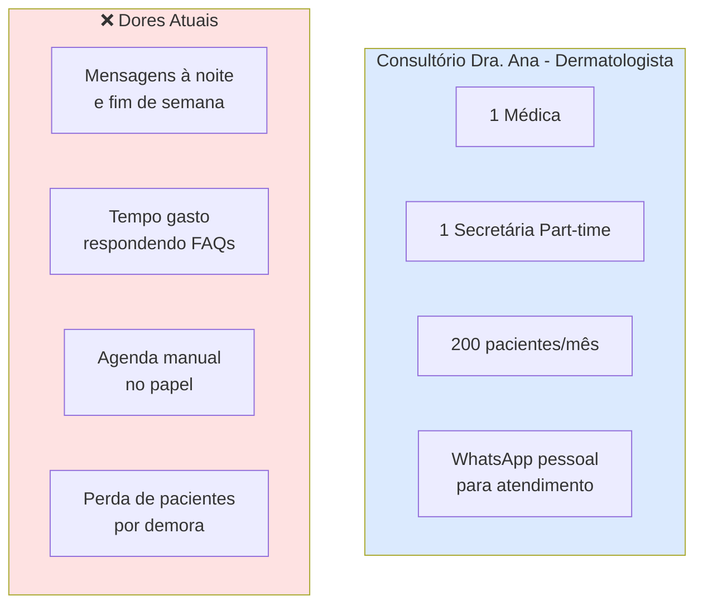

### 🎯 Implementação

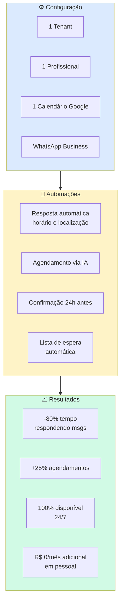

### 💬 Exemplo de Conversa

```
PACIENTE (22:30): Oi, gostaria de marcar uma consulta
BOT: Olá! 😊 Seja bem-vindo(a) ao consultório da Dra. Ana.

Para agendar sua consulta, preciso de algumas informações:
- Qual seu nome completo?
- É sua primeira consulta conosco?

PACIENTE: Maria Silva, primeira vez

BOT: Prazer, Maria! 

📅 Horários disponíveis esta semana:
• Terça 10h
• Quarta 14h  
• Quinta 9h ou 16h

Qual horário você prefere?

PACIENTE: Quarta 14h

BOT: ✅ Perfeito! Sua consulta está agendada:

📋 Confirmação:
• Dra. Ana Souza - Dermatologista
• Data: Quarta, 08/01/2026 às 14h
• Duração: 30 minutos
• Valor: R$ 350,00
• Local: Rua das Flores, 123 - Sala 45

⚠️ Importante:
• Traga exames recentes se tiver
• Chegue 10 min antes para cadastro

Até quarta! 💜
```

### 📊 ROI Calculado

| Métrica | Antes | Depois | Economia |
|---------|-------|--------|----------|
| **Horas respondendo/mês** | 40h | 5h | 35h |
| **Custo hora secretária** | R$ 25 | R$ 25 | - |
| **Economia mensal** | - | - | R$ 875 |
| **Custo sistema** | - | R$ 297 | - |
| **ROI Líquido** | - | - | **R$ 578/mês** |

---

## Cenário 2: Clínica Multi-Profissional

### 👤 Perfil

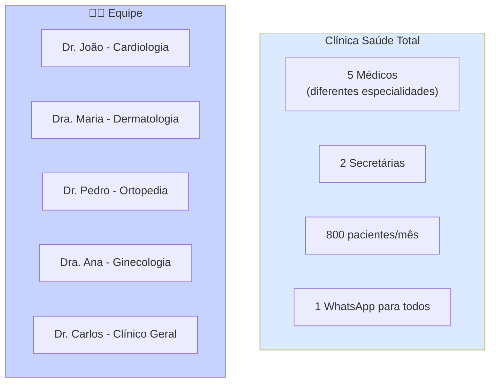

### 🎯 Fluxo de Roteamento

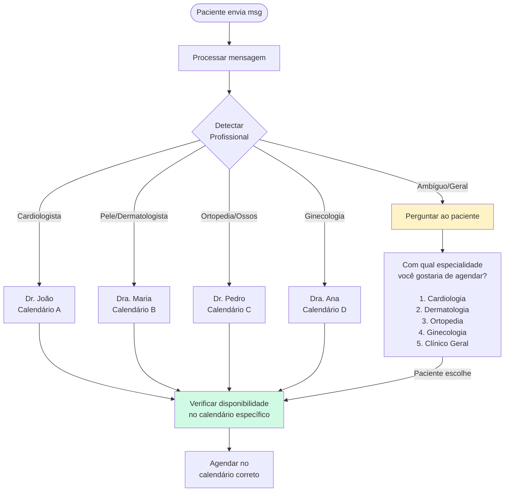

### 💬 Exemplo de Conversa Multi-Profissional

```
PACIENTE: Oi, preciso marcar uma consulta

BOT: Olá! 😊 Bem-vindo à Clínica Saúde Total.

Temos várias especialidades disponíveis:
• 🫀 Cardiologia - Dr. João Silva
• 🧴 Dermatologia - Dra. Maria Costa  
• 🦴 Ortopedia - Dr. Pedro Santos
• 👩 Ginecologia - Dra. Ana Oliveira
• 🩺 Clínico Geral - Dr. Carlos Lima

Com qual especialidade você gostaria de agendar?

PACIENTE: Preciso de um cardiologista

BOT: Perfeito! O Dr. João Silva é nosso Cardiologista.

📋 Informações da consulta:
• Duração: 40 minutos
• Valor: R$ 400,00

📅 Próximos horários disponíveis:
• Segunda 09:00
• Terça 14:00
• Quinta 10:30

Qual prefere?

PACIENTE: Segunda 9h

BOT: ✅ Agendado com sucesso!

📋 Sua consulta:
• Dr. João Silva - Cardiologia
• Segunda, 06/01/2026 às 09:00
• Valor: R$ 400,00

⚠️ Importante para consulta cardiológica:
• Traga exames anteriores
• Evite café no dia
• Jejum de 4h se for fazer ECG

Até segunda! 🫀
```

### 📊 Configuração de Banco de Dados

```sql
-- Profissionais da Clínica Saúde Total
INSERT INTO professionals (tenant_id, professional_name, specialty, google_calendar_id) VALUES
('saude-total-uuid', 'Dr. João Silva', 'Cardiologia', 'joao@calendar.google.com'),
('saude-total-uuid', 'Dra. Maria Costa', 'Dermatologia', 'maria@calendar.google.com'),
('saude-total-uuid', 'Dr. Pedro Santos', 'Ortopedia', 'pedro@calendar.google.com'),
('saude-total-uuid', 'Dra. Ana Oliveira', 'Ginecologia', 'ana@calendar.google.com'),
('saude-total-uuid', 'Dr. Carlos Lima', 'Clínico Geral', 'carlos@calendar.google.com');

-- Serviços por profissional (preços e durações diferentes)
INSERT INTO professional_services (professional_id, service_id, custom_duration_minutes, custom_price_cents) VALUES
-- Dr. João - Cardiologia
('joao-uuid', 'consulta-uuid', 40, 40000),
('joao-uuid', 'ecg-uuid', 30, 15000),
('joao-uuid', 'holter-uuid', 60, 50000),
-- Dra. Maria - Dermatologia  
('maria-uuid', 'consulta-uuid', 30, 35000),
('maria-uuid', 'botox-uuid', 60, 120000),
('maria-uuid', 'peeling-uuid', 45, 80000);
```

---

## Cenário 3: Clínica Odontológica

### 👤 Perfil

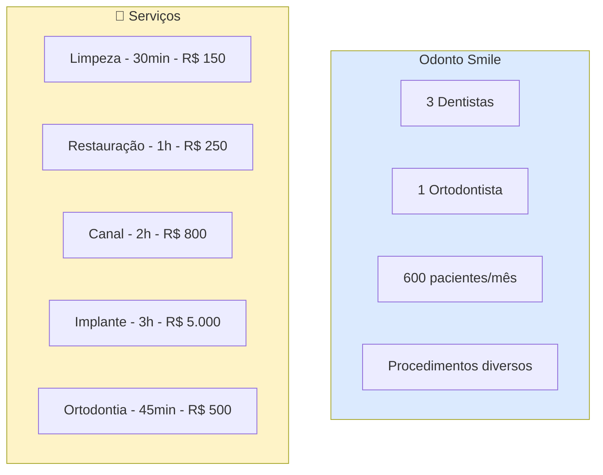

### 🎯 Fluxo com Validação de Duração

```mermaid
flowchart TD
    START([Paciente quer implante]) --> LOOKUP[Buscar serviço<br/>'implante']
    
    LOOKUP --> INFO["Implante Dentário<br/>Duração: 3 horas<br/>Valor: R$ 5.000<br/>Profissional: Dr. Ricardo"]
    
    INFO --> PRESENT[Apresentar ao paciente]
    
    PRESENT --> PATIENT[Paciente: "Pode ser<br/>amanhã às 14h?"]
    
    PATIENT --> CHECK{Verificar slot<br/>14h-17h livre?}
    
    CHECK -->|"Sim (3h disponíveis)"| BOOK[✅ Agendar<br/>14:00 - 17:00]
    CHECK -->|"Não (só até 16h)"| REJECT["❌ Slot insuficiente<br/>Preciso de 3h livres"]
    
    REJECT --> SUGGEST["Horários com 3h disponíveis:<br/>• Seg 08:00-11:00<br/>• Qua 14:00-17:00"]
    
    BOOK --> CONFIRM["✅ Agendado!<br/>Dr. Ricardo<br/>14:00 às 17:00<br/>R$ 5.000"]
    
    style CHECK fill:#fef3c7
    style BOOK fill:#d1fae5
    style REJECT fill:#fee2e2
```

### 💬 Exemplo de Conversa

```
PACIENTE: Quero fazer um implante

BOT: Olá! O procedimento de Implante Dentário é realizado pelo Dr. Ricardo.

📋 Detalhes do procedimento:
• Duração: 3 horas
• Valor: R$ 5.000,00
• Anestesia: Local
• Recuperação: 7-10 dias

⚠️ Pré-requisitos:
• Exame panorâmico recente
• Avaliação prévia (se primeira vez)

Gostaria de agendar?

PACIENTE: Sim, pode ser quinta às 15h?

BOT: Deixa eu verificar... 🔍

O procedimento precisa de 3 horas, mas quinta às 15h só temos disponibilidade até 17h (2 horas).

📅 Horários com 3h disponíveis:
• Quinta 08:00-11:00 ✅
• Sexta 14:00-17:00 ✅

Qual prefere?

PACIENTE: Sexta 14h

BOT: ✅ Perfeito! Agendamento confirmado:

📋 Implante Dentário
• Dr. Ricardo Almeida
• Sexta, 10/01/2026
• Horário: 14:00 às 17:00 (3h)
• Valor: R$ 5.000,00

⚠️ Instruções importantes:
• Traga exame panorâmico
• Evite anti-inflamatórios 3 dias antes
• Alimente-se normalmente
• Traga acompanhante

Até sexta! 🦷
```

---

## Cenário 4: Clínica Estética

### 👤 Perfil

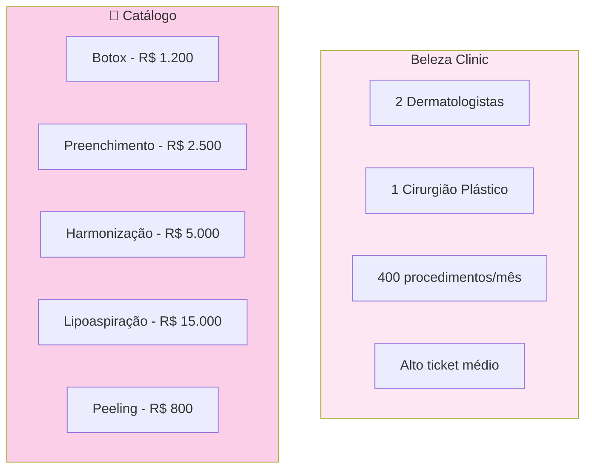

### 🎯 Fluxo de Upsell Inteligente

```mermaid
flowchart TD
    START([Paciente: "Quero Botox"]) --> BOOK[Agendar Botox<br/>R$ 1.200]
    
    BOOK --> DETECT[IA detecta<br/>interesse em estética]
    
    DETECT --> UPSELL["💡 Sugestão Complementar:<br/>'Muitos pacientes combinam<br/>Botox + Preenchimento para<br/>resultado completo.<br/>Combo: R$ 3.200 (economia R$ 500)'"]
    
    UPSELL --> ACCEPT{Paciente<br/>aceita?}
    
    ACCEPT -->|Sim| COMBO[Agendar Combo<br/>2h - R$ 3.200]
    ACCEPT -->|Não| SINGLE[Manter só Botox<br/>1h - R$ 1.200]
    
    COMBO & SINGLE --> CONFIRM[Enviar confirmação]
    
    CONFIRM --> FOLLOWUP["📅 Lembrete automático<br/>em 4 meses:<br/>'Hora de renovar seu Botox!'"]
    
    style UPSELL fill:#fef3c7
    style COMBO fill:#d1fae5
```

### 📊 Automação de Retorno

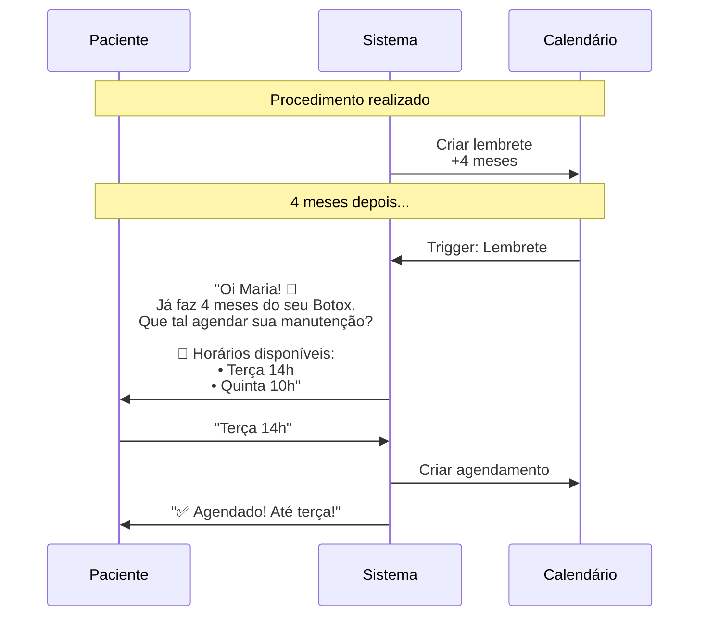

---

## Cenário 5: Rede de Clínicas

### 👤 Perfil

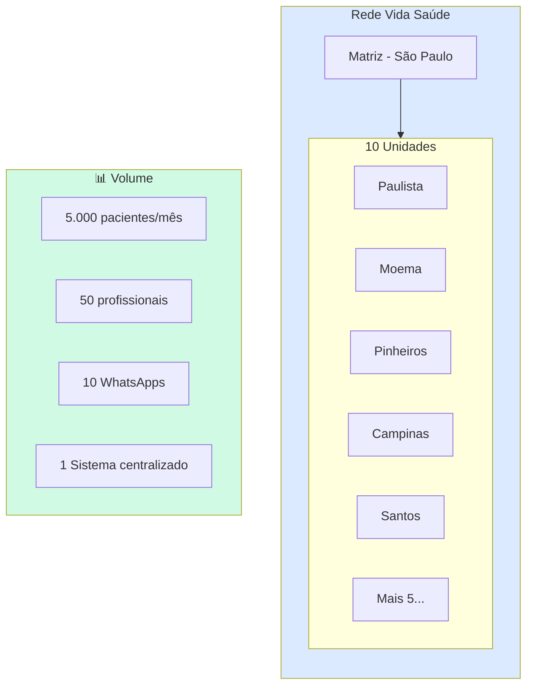

### 🎯 Arquitetura Multi-Tenant

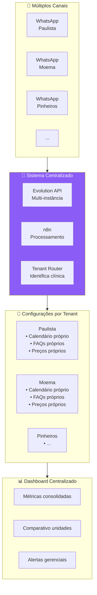

### 📊 Dashboard Gerencial

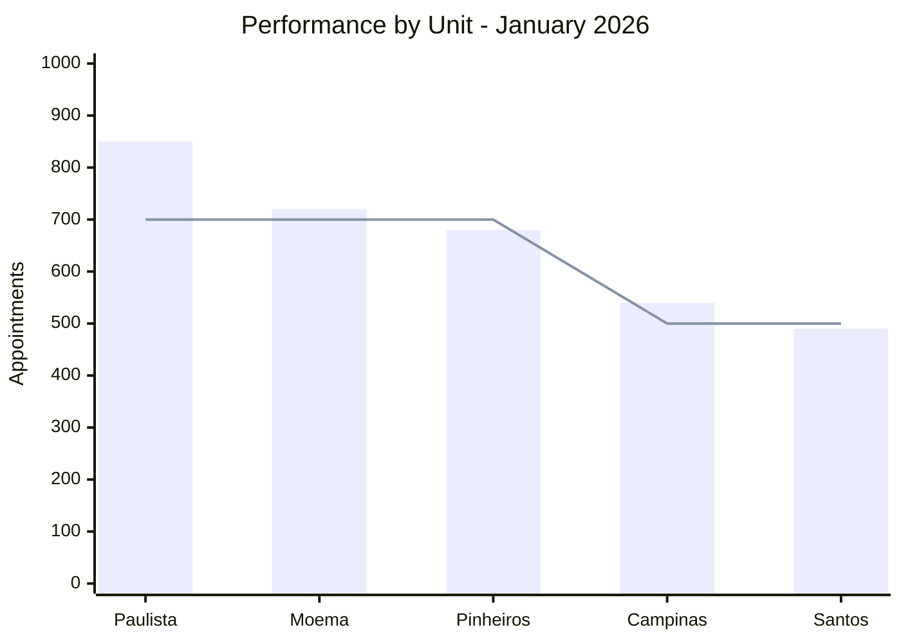

> **Performance por Unidade**: Agendamentos realizados vs Meta por filial.

| Unidade | Mensagens | Agendamentos | Conversão | Custo IA |
|---------|-----------|--------------|-----------|----------|
| **Paulista** | 2.100 | 850 | 40% | R$ 126 |
| **Moema** | 1.800 | 720 | 40% | R$ 108 |
| **Pinheiros** | 1.600 | 680 | 43% | R$ 96 |
| **Campinas** | 1.200 | 540 | 45% | R$ 72 |
| **Santos** | 1.100 | 490 | 45% | R$ 66 |
| **TOTAL** | 7.800 | 3.280 | 42% | R$ 468 |

### 💰 ROI Rede de Clínicas

| Métrica | Sem Sistema | Com Sistema | Diferença |
|---------|-------------|-------------|-----------|
| **Secretárias** | 20 (2/unidade) | 12 | -8 pessoas |
| **Custo Mensal Pessoal** | R$ 60.000 | R$ 36.000 | -R$ 24.000 |
| **Sistema** | R$ 0 | R$ 15.000 | +R$ 15.000 |
| **Economia Líquida** | - | - | **R$ 9.000/mês** |
| **Economia Anual** | - | - | **R$ 108.000** |

---

## Cenário 6: Hospital/Centro Médico

### 👤 Perfil

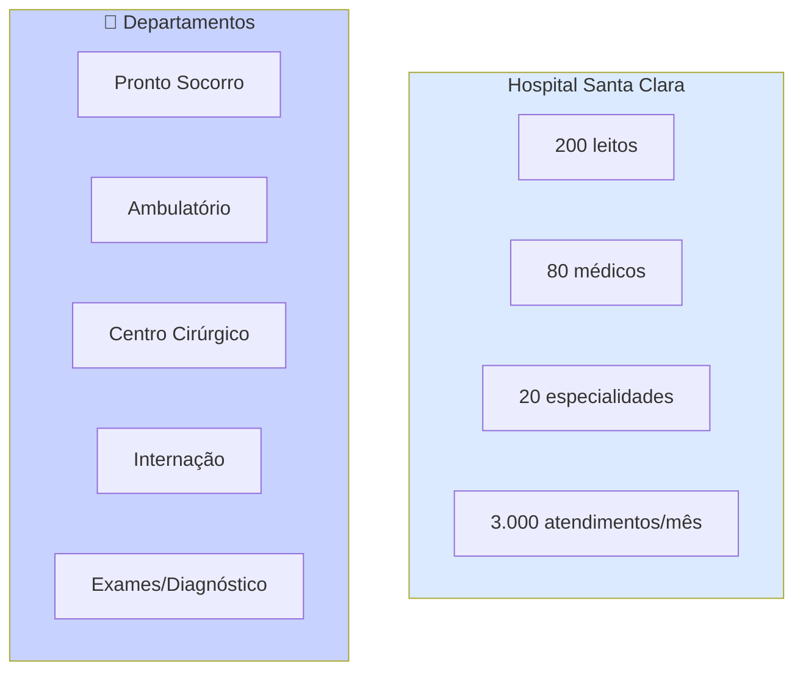

### 🎯 Fluxo de Triagem Inteligente

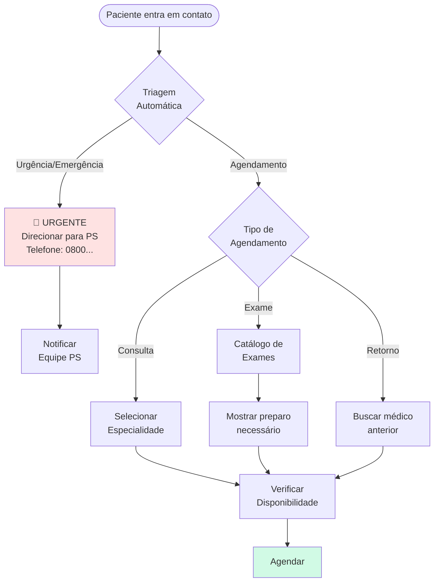

### 💬 Fluxo de Exames com Preparo

```
PACIENTE: Preciso fazer um exame de sangue

BOT: Olá! 😊 Para exames laboratoriais, preciso de algumas informações:

Qual exame você precisa realizar?
1. Hemograma Completo
2. Glicemia
3. Colesterol/Triglicerídeos
4. Função Renal
5. Função Hepática
6. Outro (descreva)

PACIENTE: Glicemia e Colesterol

BOT: Perfeito! Selecionados:
• Glicemia em Jejum
• Perfil Lipídico (Colesterol + Triglicerídeos)

⚠️ PREPARO NECESSÁRIO:
━━━━━━━━━━━━━━━━━━
• Jejum de 12 horas
• Água pode beber normalmente
• Evitar exercícios intensos 24h antes
• Não consumir álcool 72h antes

📅 Horários disponíveis (manhã para jejum):
• Segunda 07:00
• Terça 07:30
• Quarta 08:00

Qual prefere?

PACIENTE: Segunda 7h

BOT: ✅ Exames agendados!

📋 Confirmação:
• Hospital Santa Clara - Laboratório
• Segunda, 06/01/2026 às 07:00
• Exames: Glicemia + Perfil Lipídico
• Valor: R$ 120,00

📍 Local: Térreo, Ala B - Coleta

⏰ Lembrete: Jejum de 12h!
Último horário para alimentação: Domingo 19h

Até segunda! 🩺
```

---

## 📊 Comparativo de Cenários

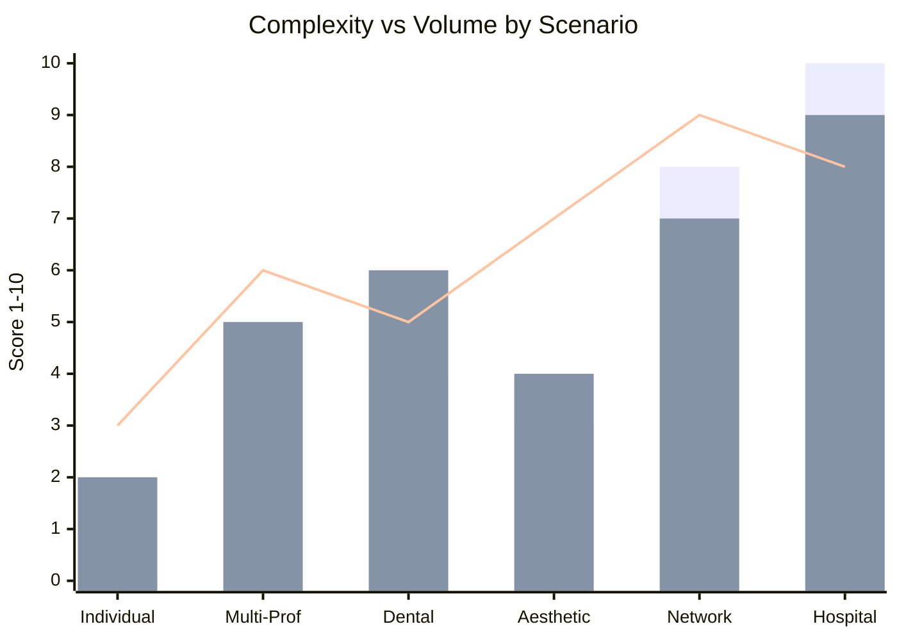

> **Complexidade vs Volume**: Individual, Multi-Profissional, Odonto, Estética, Rede, Hospital

| Cenário | Mensalidade Sugerida | Setup | ROI Típico |
|---------|---------------------|-------|------------|
| **Individual** | R$ 297 | R$ 500 | 2-3x |
| **Multi-Prof** | R$ 697 | R$ 2.000 | 3-4x |
| **Odontológica** | R$ 697 | R$ 2.500 | 3-4x |
| **Estética** | R$ 997 | R$ 3.000 | 4-5x |
| **Rede** | R$ 5.000+ | R$ 15.000 | 5-8x |
| **Hospital** | Sob consulta | R$ 50.000+ | 3-5x |

---

## 🎯 Próximos Passos por Cenário

### Consultório Individual
1. Criar trial 14 dias
2. Configurar WhatsApp Business
3. Importar FAQs básicos
4. Go-live em 3 dias

### Clínica Multi-Profissional
1. Mapear todos profissionais e serviços
2. Configurar calendários individuais
3. Definir regras de roteamento
4. Treinamento equipe (4h)
5. Go-live em 7 dias

### Rede de Clínicas
1. Workshop de discovery (1 dia)
2. Documentar processos por unidade
3. Configurar multi-tenant
4. Piloto em 1 unidade
5. Rollout gradual
6. Go-live total em 30-60 dias

---

**Versão do Documento**: 1.0  
**Última Atualização**: 03-01-2026  
**Classificação**: Proprietário e Confidencial

