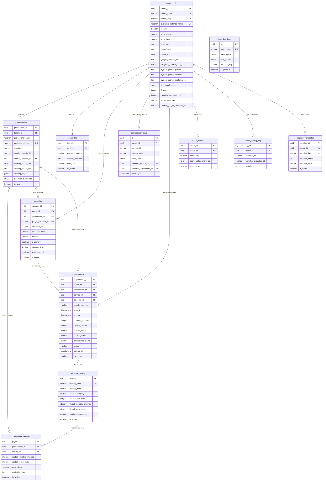

# Database Entity-Relationship Diagram

This document describes the complete database schema for the Multi-Tenant Clinic SaaS system.

## Overview

The database is designed for strict multi-tenancy where:
- Every tenant (clinic) is isolated by `tenant_id`
- Onboarding a new clinic = DB inserts only, no workflow edits
- Professional-Service matrix drives pricing and duration
- Google Calendar integration is per-professional

## Entity-Relationship Diagram



## Table Descriptions

### Core Tables

#### `tenant_config` (Tenants/Clinics)
The central table for multi-tenant configuration. Each row represents one clinic.

| Column | Type | Description |
|--------|------|-------------|
| `tenant_id` | UUID | Primary key |
| `tenant_name` | VARCHAR | Unique tenant name |
| `evolution_instance_name` | VARCHAR | WhatsApp instance identifier (unique) |
| `clinic_name` | VARCHAR | Display name for the clinic |
| `clinic_type` | VARCHAR | Type: 'medical', 'aesthetic', 'mixed', 'dental' |
| `timezone` | VARCHAR | Default: 'America/Sao_Paulo' |
| `system_prompt_patient` | TEXT | AI prompt for patient interactions |
| `system_prompt_internal` | TEXT | AI prompt for internal assistant |
| `features` | JSONB | Feature flags (audio_transcription, image_ocr, etc.) |
| `default_google_credential_id` | VARCHAR | Default n8n credential for Google Calendar |

#### `professionals` (Doctors/Staff)
Each professional belongs to a tenant and has their own Google Calendar.

| Column | Type | Description |
|--------|------|-------------|
| `professional_id` | UUID | Primary key |
| `tenant_id` | UUID | FK to tenant_config |
| `professional_name` | VARCHAR | Full name |
| `professional_slug` | VARCHAR | URL-safe identifier (unique per tenant) |
| `specialty` | VARCHAR | Primary specialty |
| `google_calendar_id` | VARCHAR | Individual Google Calendar ID |
| `default_calendar_id` | UUID | FK to calendars table |
| `slot_interval_minutes` | INTEGER | Base slot granularity (default: 30) |
| `working_hours_start/end` | TIME | Working hours |
| `working_days` | JSONB | Array of working days (0-6) |

#### `services_catalog` (Global Services)
Master list of all services offered by any clinic.

| Column | Type | Description |
|--------|------|-------------|
| `service_id` | UUID | Primary key |
| `service_code` | VARCHAR | Machine-readable code (unique) |
| `service_name` | VARCHAR | Human-readable name |
| `service_category` | VARCHAR | Category for grouping |
| `service_keywords` | TEXT[] | Keywords for AI matching |
| `default_duration_minutes` | INTEGER | Default duration |
| `default_price_cents` | INTEGER | Default price in cents |
| `requires_preparation` | BOOLEAN | Whether patient needs to prepare |

#### `professional_services` (Junction Table)
**CRITICAL**: Links professionals to services with CUSTOM duration and pricing.

| Column | Type | Description |
|--------|------|-------------|
| `ps_id` | UUID | Primary key |
| `professional_id` | UUID | FK to professionals |
| `service_id` | UUID | FK to services_catalog |
| `custom_duration_minutes` | INTEGER | **This professional's duration for this service** |
| `custom_price_cents` | INTEGER | **This professional's price for this service** |
| `price_display` | VARCHAR | Formatted price string |
| `available_days` | JSONB | Service-specific availability |

### Calendar & Scheduling Tables

#### `calendars` (Calendar Configuration)
Centralizes Google Calendar configuration per professional/tenant.

| Column | Type | Description |
|--------|------|-------------|
| `calendar_id` | UUID | Primary key |
| `tenant_id` | UUID | FK to tenant_config |
| `professional_id` | UUID | FK to professionals (nullable for shared calendars) |
| `google_calendar_id` | VARCHAR | Google Calendar ID |
| `credential_ref` | VARCHAR | n8n credential ID or env key |
| `credential_type` | VARCHAR | 'n8n_credential', 'env_key', 'tenant_default' |
| `is_primary` | BOOLEAN | Primary calendar for the professional |
| `sync_enabled` | BOOLEAN | Whether to sync with this calendar |

#### `appointments` (Appointment Records)
Persisted appointment records with audit trail and soft delete.

| Column | Type | Description |
|--------|------|-------------|
| `appointment_id` | UUID | Primary key |
| `tenant_id` | UUID | FK to tenant_config |
| `professional_id` | UUID | FK to professionals |
| `service_id` | UUID | FK to services_catalog |
| `calendar_id` | UUID | FK to calendars |
| `google_event_id` | VARCHAR | Google Calendar event ID |
| `start_at` | TIMESTAMPTZ | Appointment start time |
| `end_at` | TIMESTAMPTZ | Appointment end time |
| `duration_minutes` | INTEGER | Duration (stored for reference) |
| `patient_contact` | VARCHAR | WhatsApp/phone number |
| `patient_name` | VARCHAR | Patient name |
| `status` | VARCHAR | 'scheduled', 'confirmed', 'completed', 'cancelled', 'no_show', 'rescheduled' |
| `deleted_at` | TIMESTAMPTZ | **Soft delete timestamp (NULL = active)** |
| `sync_status` | VARCHAR | 'pending', 'synced', 'error', 'deleted' |

### Conversation & State Management

#### `conversation_state` (User Session State)
Tracks conversation state for each user, replacing AI memory for common flows.

| Column | Type | Description |
|--------|------|-------------|
| `id` | UUID | Primary key |
| `tenant_id` | UUID | FK to tenant_config |
| `remote_jid` | VARCHAR | User's WhatsApp ID |
| `current_state` | VARCHAR | Current state machine state |
| `state_data` | JSONB | Additional state data |
| `selected_service_id` | UUID | Service being booked |
| `selected_professional_id` | UUID | Professional being booked |
| `expires_at` | TIMESTAMP | Session expiration |

#### `state_definitions` (State Machine Configuration)
Defines valid states and transitions for the conversation state machine.

| Column | Type | Description |
|--------|------|-------------|
| `state_name` | VARCHAR | Unique state identifier |
| `valid_inputs` | JSONB | Mapping of user inputs to actions |
| `next_states` | JSONB | Mapping of actions to next states |
| `template_key` | VARCHAR | Response template to use |
| `requires_ai` | BOOLEAN | Whether this state needs AI processing |

### Supporting Tables

#### `tenant_faq` (FAQ Responses)
Pre-configured FAQ responses per tenant.

#### `response_templates` (Message Templates)
Reusable message templates per tenant.

#### `tenant_secrets` (Encrypted Secrets)
Secure storage for API keys and credentials.

#### `tenant_activity_log` (Activity Audit)
Logs all tenant activities for audit and debugging.

## Key Functions

### Service Resolution

```sql
-- Find professionals who offer a specific service
SELECT * FROM find_professionals_for_service(
    p_tenant_id UUID,
    p_search_text TEXT
);
-- Returns: professional details + custom_duration_minutes + custom_price_cents

-- Get service details for a specific professional
SELECT * FROM get_professional_service_details(
    p_professional_id UUID,
    p_service_id UUID
);

-- Calculate appointment end time
SELECT calculate_appointment_end_time(
    p_start_time TIMESTAMPTZ,
    p_professional_id UUID,
    p_service_id UUID
);
```

### Calendar Operations

```sql
-- Get calendar for a professional
SELECT * FROM get_calendar_for_professional(
    p_tenant_id UUID,
    p_professional_id UUID
);

-- Register a new calendar
SELECT register_professional_calendar(
    p_tenant_id UUID,
    p_professional_id UUID,
    p_google_calendar_id VARCHAR,
    p_credential_ref VARCHAR,
    p_is_primary BOOLEAN
);
```

### Appointment Operations

```sql
-- Create appointment (auto-calculates end time from service duration)
SELECT * FROM create_appointment(
    p_tenant_id UUID,
    p_professional_id UUID,
    p_service_id UUID,
    p_start_at TIMESTAMPTZ,
    p_patient_contact VARCHAR,
    p_patient_name VARCHAR,
    p_created_via VARCHAR
);

-- Cancel with soft delete
SELECT * FROM cancel_appointment(
    p_appointment_id UUID,
    p_cancelled_by VARCHAR,
    p_reason TEXT
);

-- Reschedule (creates new, soft deletes old)
SELECT * FROM reschedule_appointment(
    p_appointment_id UUID,
    p_new_start_at TIMESTAMPTZ,
    p_rescheduled_by VARCHAR
);
```

### Conversation State

```sql
-- Get or create session
SELECT * FROM get_or_create_conversation_state(
    p_tenant_id UUID,
    p_remote_jid VARCHAR
);

-- Transition to next state
SELECT * FROM transition_conversation_state(
    p_tenant_id UUID,
    p_remote_jid VARCHAR,
    p_input TEXT,
    p_additional_data JSONB
);
```

## Critical Relationships

### Professional-Service Matrix

The `professional_services` table is the **single source of truth** for "Dr. A / Ultrasound / 30 min / $100" vs "Dr. B / Ultrasound / 45 min / $150".

All workflow logic (availability, booking, confirmation) must use:
- `custom_duration_minutes` from `professional_services`
- `custom_price_cents` from `professional_services`

**Never** use `default_duration_minutes` or `default_price_cents` from `services_catalog` for actual bookings.

### Tenant Isolation

Every query must filter by `tenant_id`. The `evolution_instance_name` from webhooks resolves to `tenant_id` via:

```sql
SELECT * FROM get_tenant_by_instance('instance_name');
```

### Soft Delete Pattern

Appointments use soft delete:
- Active: `deleted_at IS NULL`
- Deleted: `deleted_at IS NOT NULL`

All "list" queries should filter `WHERE deleted_at IS NULL`.

## Migration Order

1. `001_create_tenant_tables.sql` - Core tenant configuration
2. `002_seed_tenant_data.sql` - Sample data
3. `003_create_faq_table.sql` - FAQ system
4. `004_create_service_catalog_architecture.sql` - Services & professionals
5. `005_seed_service_catalog_data.sql` - Sample services
6. `021_response_templates.sql` - Message templates
7. `022_conversation_state.sql` - State machine
8. `023_create_calendars_table.sql` - Calendar configuration
9. `024_create_appointments_table.sql` - Appointment tracking

## Views

| View | Purpose |
|------|---------|
| `v_active_tenants` | Active tenants with usage stats |
| `v_service_offerings` | Complete service catalog with customizations |
| `v_professionals_services_prompt` | AI-friendly professional + services context |
| `v_calendars_overview` | Calendar configuration overview |
| `v_active_appointments` | Appointments excluding soft deleted |
| `v_todays_appointments` | Today's appointments only |
| `v_pending_sync_appointments` | Appointments needing Google sync |