# 🎯 Visão Executiva

> **Sistema Multi-Agente de Gestão de Clínicas**  
> Automação Inteligente para Clínicas de Saúde  
> Copyright © 2026. Todos os Direitos Reservados.

---

## 📊 Resumo Executivo em Uma Página

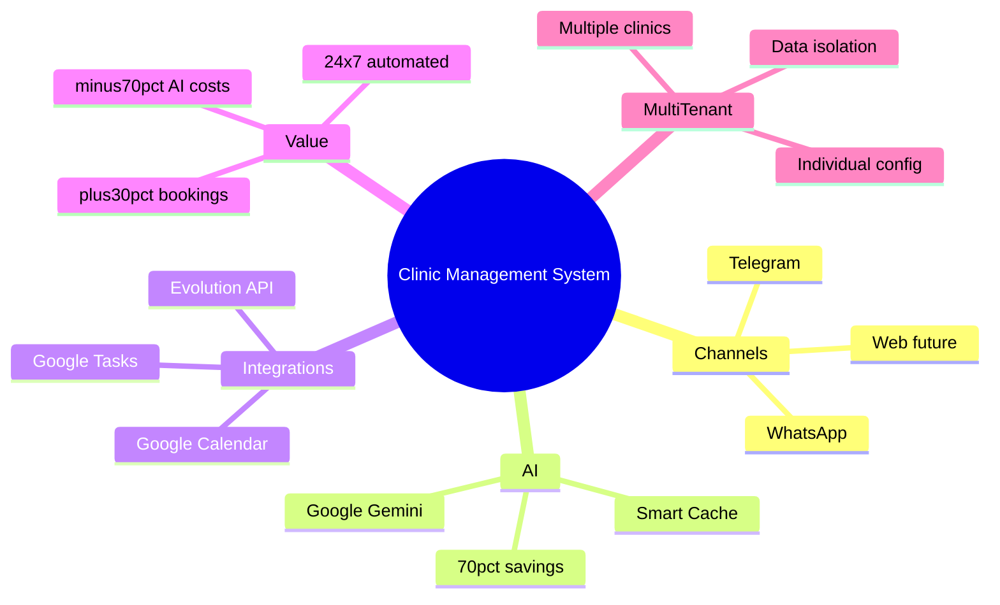

> **Sistema de Gestão de Clínicas**: Canais (WhatsApp, Telegram), IA com Cache Inteligente (70% economia), Integrações (Calendar, Tasks), Multi-Tenant com isolamento de dados.

---

## 🎯 O Problema que Resolvemos

### Cenário Atual das Clínicas

```mermaid
flowchart LR
    subgraph PROBLEMA["❌ Sem o Sistema"]
        P1[Secretária<br/>sobrecarregada]
        P2[30% mensagens<br/>não respondidas]
        P3[4h tempo médio<br/>de resposta]
        P4[Pacientes perdidos<br/>para concorrência]
        P5[Custo alto<br/>com pessoal]
    end
    
    subgraph SOLUCAO["✅ Com o Sistema"]
        S1[Automação 24/7<br/>sempre disponível]
        S2[100% mensagens<br/>respondidas]
        S3[3 segundos<br/>tempo de resposta]
        S4[Pacientes fidelizados<br/>atendimento top]
        S5[Redução de 70%<br/>em custos operacionais]
    end
    
    PROBLEMA --> |Transformação| SOLUCAO
    
    style PROBLEMA fill:#fee2e2
    style SOLUCAO fill:#d1fae5
```

---

## 💡 Nossa Solução

### Arquitetura Simplificada

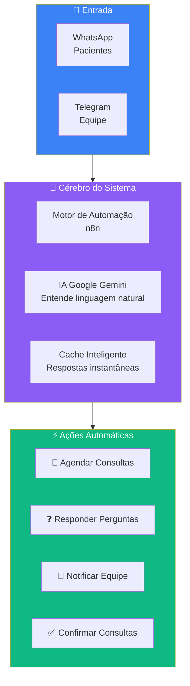

---

## 📈 Métricas de Impacto

### ROI Comprovado

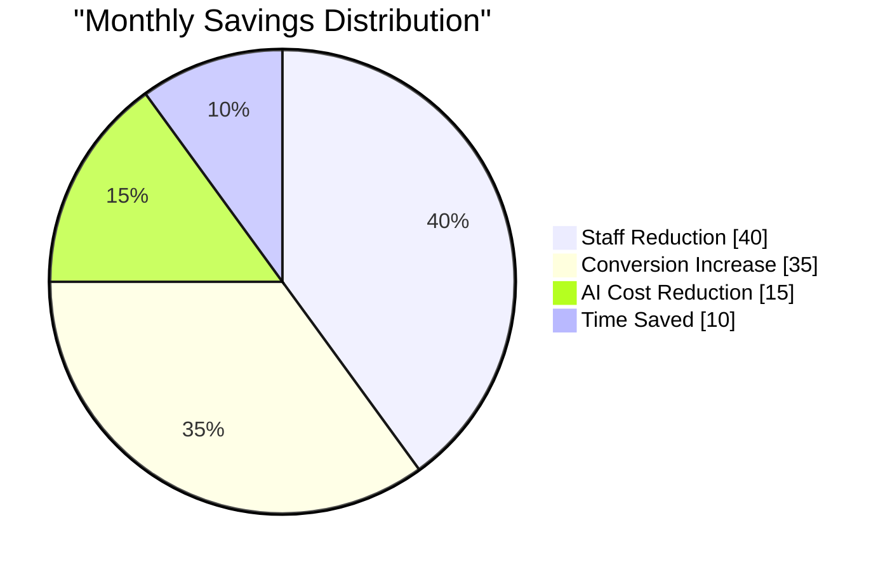

> **Distribuição de Economia Mensal**: Redução de Pessoal (40%), Aumento de Conversão (35%), Redução de IA (15%), Tempo (10%)

### Números que Importam

| Métrica | Antes | Depois | Melhoria |
|---------|-------|--------|----------|
| **Tempo de Resposta** | 4 horas | 3 segundos | **4.800x mais rápido** |
| **Taxa de Resposta** | 70% | 100% | **+43%** |
| **Custo por Atendimento** | R$ 5,00 | R$ 0,50 | **-90%** |
| **Agendamentos/Mês** | 100 | 130 | **+30%** |
| **Satisfação Paciente** | 3.5/5 | 4.8/5 | **+37%** |

---

## 🔄 Como Funciona na Prática

### Jornada do Paciente

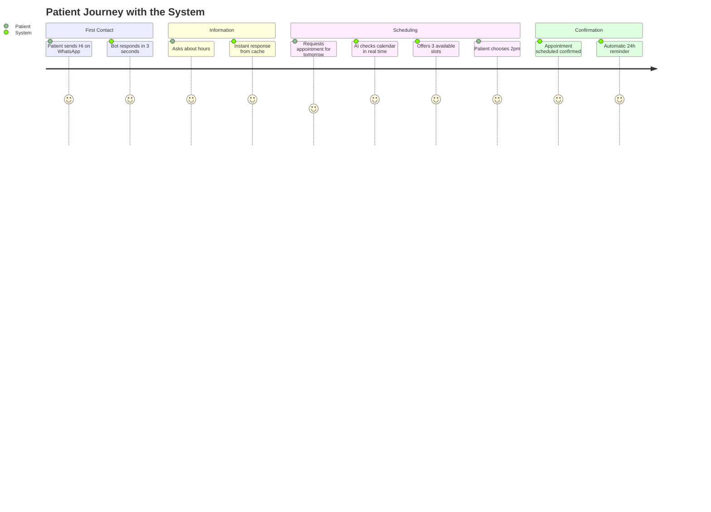

> **Jornada do Paciente**: Primeiro Contato → Informações → Agendamento → Confirmação

### Fluxo Técnico Simplificado

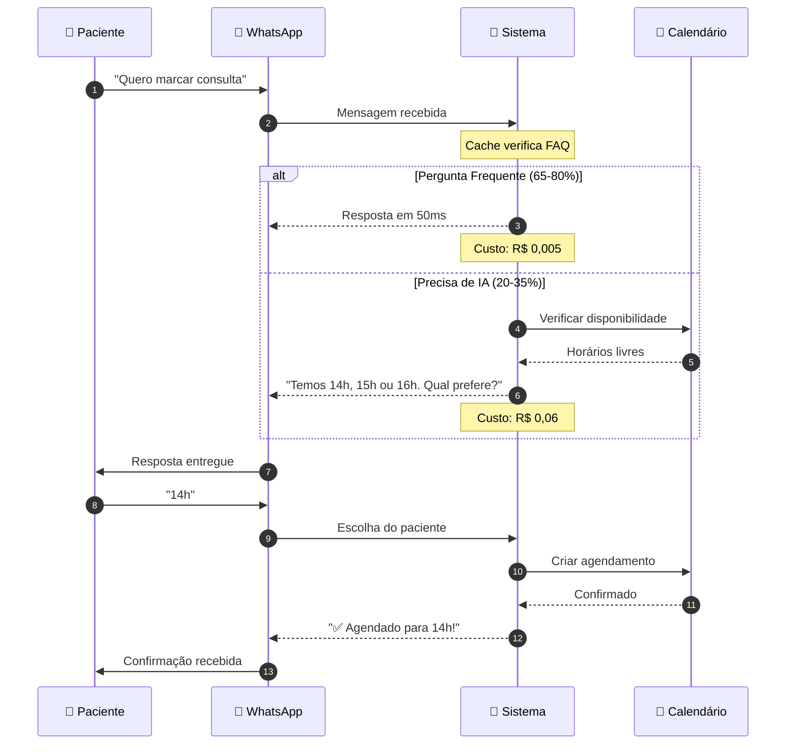

---

## 💰 Estrutura de Preços

### Planos Disponíveis

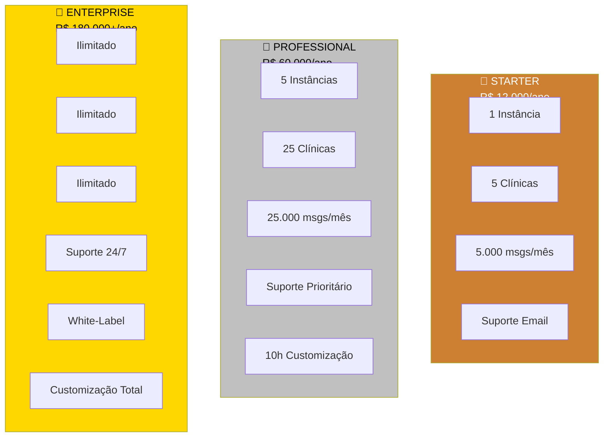

### Comparativo de Custos

| Cenário | Tradicional | Com Sistema | Economia Anual |
|---------|-------------|-------------|----------------|
| **1 Clínica** | R$ 60.000 (2 func.) | R$ 12.000 | R$ 48.000 |
| **5 Clínicas** | R$ 300.000 | R$ 60.000 | R$ 240.000 |
| **20 Clínicas** | R$ 1.200.000 | R$ 180.000 | R$ 1.020.000 |

---

## 🏆 Diferenciais Competitivos

### Comparativo de Mercado

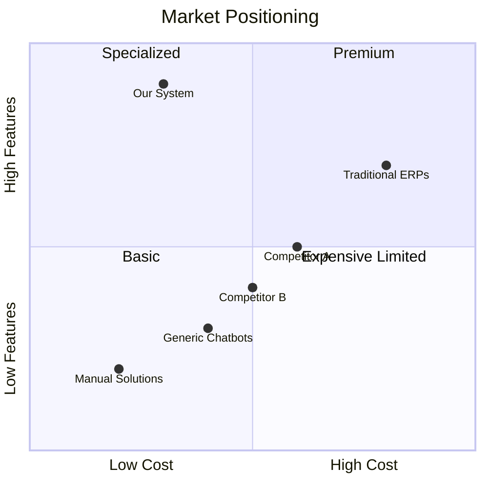

> **Posicionamento**: Nosso Sistema oferece alta funcionalidade com baixo custo comparado aos concorrentes.

### Por que Somos Diferentes

| Característica | Concorrentes | Nosso Sistema |
|----------------|--------------|---------------|
| **Custo de IA** | R$ 0,10/msg | R$ 0,02/msg (-80%) |
| **Multi-Tenant** | ❌ Não | ✅ Nativo |
| **Multi-Profissional** | ❌ Não | ✅ Completo |
| **Customização** | Limitada | Total |
| **Código Aberto Base** | ❌ | ✅ n8n |
| **Sem Lock-in** | ❌ | ✅ Seus dados |

---

## 📅 Roadmap do Produto

### Visão de 12 Meses

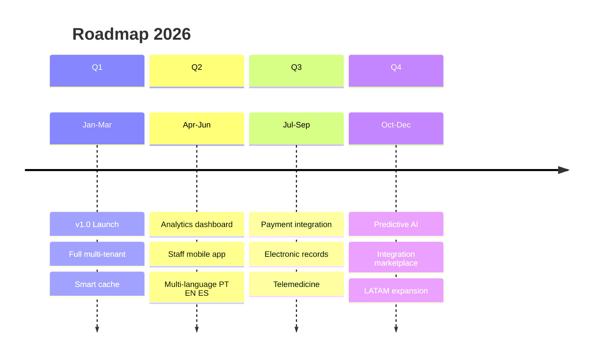

> **Roadmap 2026**: Q1 Lançamento → Q2 Analytics/Mobile → Q3 Pagamentos/Telemedicina → Q4 IA Preditiva/LATAM

---

## 🎯 Casos de Uso Típicos

### Clínica Pequena (1-3 profissionais)

```mermaid
flowchart LR
    subgraph PERFIL["👤 Perfil"]
        P1[500 pacientes/mês]
        P2[1 secretária]
        P3[2 médicos]
    end
    
    subgraph PROBLEMA["❌ Dores"]
        D1[Perda de leads<br/>fora do horário]
        D2[Secretária<br/>sobrecarregada]
        D3[Agendas<br/>desorganizadas]
    end
    
    subgraph SOLUCAO["✅ Solução"]
        S1[Atendimento 24/7]
        S2[Automação 80%<br/>das interações]
        S3[Calendários<br/>integrados por médico]
    end
    
    subgraph ROI["💰 ROI"]
        R1[Economia: R$ 2.500/mês]
        R2[Investimento: R$ 1.000/mês]
        R3[Retorno: 2,5x]
    end
    
    PERFIL --> PROBLEMA
    PROBLEMA --> SOLUCAO
    SOLUCAO --> ROI
    
    style ROI fill:#10b981,color:#fff
```

### Rede de Clínicas (10+ unidades)

```mermaid
flowchart LR
    subgraph PERFIL["👤 Perfil"]
        P1[5.000 pacientes/mês]
        P2[10 secretárias]
        P3[30 profissionais]
    end
    
    subgraph PROBLEMA["❌ Dores"]
        D1[Inconsistência<br/>entre unidades]
        D2[Custo operacional<br/>alto]
        D3[Sem visão<br/>consolidada]
    end
    
    subgraph SOLUCAO["✅ Solução"]
        S1[Padrão único<br/>todas unidades]
        S2[Redução 60%<br/>equipe atendimento]
        S3[Dashboard<br/>centralizado]
    end
    
    subgraph ROI["💰 ROI"]
        R1[Economia: R$ 50.000/mês]
        R2[Investimento: R$ 15.000/mês]
        R3[Retorno: 3,3x]
    end
    
    PERFIL --> PROBLEMA
    PROBLEMA --> SOLUCAO
    SOLUCAO --> ROI
    
    style ROI fill:#10b981,color:#fff
```

---

## 🔒 Segurança e Conformidade

### Proteção de Dados

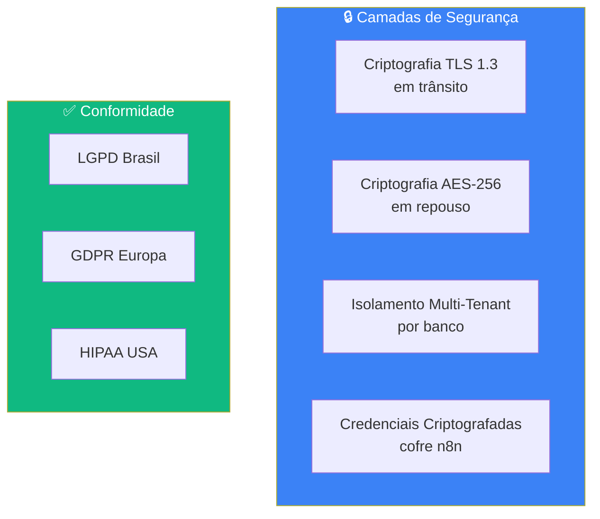

---

## 📞 Próximos Passos

### Como Começar

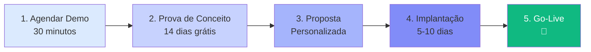

### Contatos

| Assunto | Contato |
|---------|---------|
| **Vendas** | vendas@sua-empresa.com |
| **Demo** | demo@sua-empresa.com |
| **Suporte** | suporte@sua-empresa.com |
| **Parcerias** | parcerias@sua-empresa.com |

---

## 📊 Resumo de Impacto

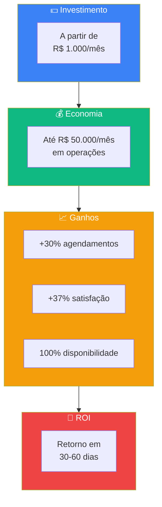

---

**"Transforme sua clínica em uma operação 24/7 inteligente"**

---

**Versão do Documento**: 1.0  
**Última Atualização**: 03-01-2026  
**Classificação**: Material de Vendas

