# 💰 Guia de Monetização

> **Documentação Proprietária**  
> Copyright © 2026. Todos os Direitos Reservados.  
> Estratégias de monetização para o Sistema Multi-Agente de Gestão de Clínicas.

---

## 📊 Visão Geral do Modelo de Negócio

Este documento apresenta estratégias comprovadas para monetizar o Sistema Multi-Agente de Gestão de Clínicas, desde operação própria até revenda como SaaS.

### Posicionamento de Mercado

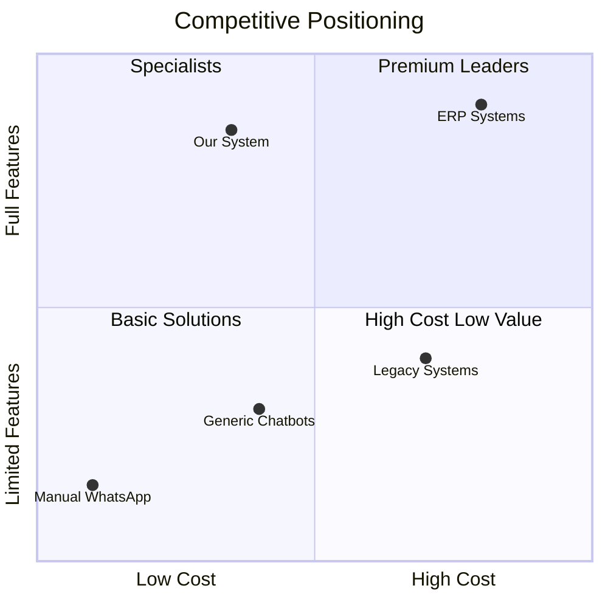

> **Legenda**: Nosso Sistema posicionado como alta funcionalidade com baixo custo relativo.

---

## 🎯 Modelos de Monetização

### Diagrama de Fluxos de Receita

```mermaid
flowchart TB
    subgraph RECEITAS["💰 Fontes de Receita"]
        direction TB
        L[🏷️ Licenciamento]
        S[🔧 Serviços]
        R[🔄 Recorrente]
        T[📈 Transacional]
    end
    
    subgraph LICENCIAMENTO["Modelo de Licenciamento"]
        L1[Licença Única<br/>R$ 12-18K/ano]
        L2[Multi-Instância<br/>R$ 60-90K/ano]
        L3[Empresarial<br/>R$ 180-300K+/ano]
    end
    
    subgraph SERVICOS["Serviços Profissionais"]
        S1[Implantação<br/>R$ 5-15K]
        S2[Customização<br/>R$ 150-250/hora]
        S3[Treinamento<br/>R$ 2-5K/turma]
        S4[Consultoria<br/>R$ 300-500/hora]
    end
    
    subgraph RECORRENTE["Receita Recorrente"]
        R1[Suporte Premium<br/>R$ 1-3K/mês]
        R2[SLA Garantido<br/>R$ 2-5K/mês]
        R3[Monitoramento 24/7<br/>R$ 3-8K/mês]
    end
    
    subgraph TRANSACIONAL["Por Transação"]
        T1[Mensagens Excedentes<br/>R$ 0.05-0.15/msg]
        T2[Agendamentos<br/>R$ 0.50-2.00/agend]
        T3[Integrações<br/>R$ 500-2K/integração]
    end
    
    L --> L1 & L2 & L3
    S --> S1 & S2 & S3 & S4
    R --> R1 & R2 & R3
    T --> T1 & T2 & T3
    
    style RECEITAS fill:#10b981,color:#fff
    style LICENCIAMENTO fill:#3b82f6,color:#fff
    style SERVICOS fill:#8b5cf6,color:#fff
    style RECORRENTE fill:#f59e0b,color:#fff
    style TRANSACIONAL fill:#ef4444,color:#fff
```

---

## 📈 Modelo 1: Venda de Licenças (B2B Direto)

### Estrutura de Preços Recomendada

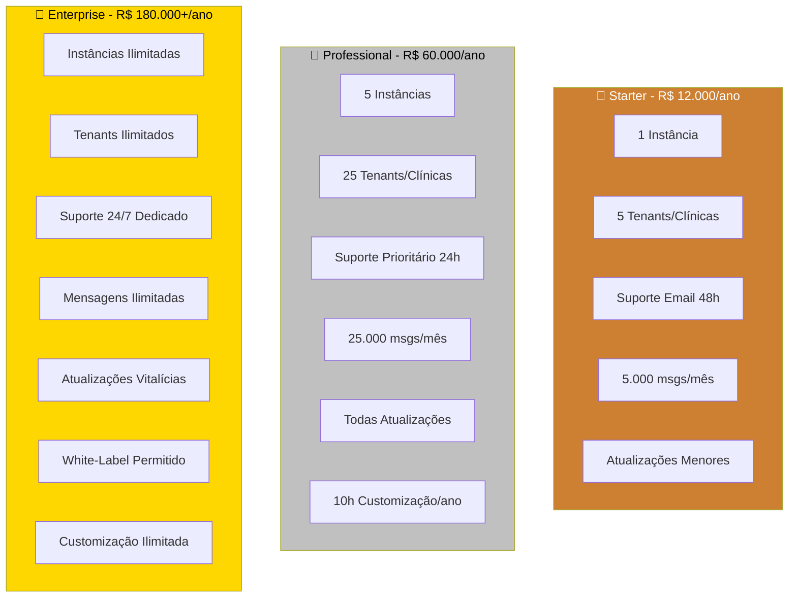

### Calculadora de Receita por Tier

| Métrica | Starter | Professional | Enterprise |
|---------|---------|--------------|------------|
| **Preço/Ano** | R$ 12.000 | R$ 60.000 | R$ 180.000 |
| **Clientes Meta** | 50 | 15 | 5 |
| **Receita Anual** | R$ 600.000 | R$ 900.000 | R$ 900.000 |
| **Custo Suporte** | ~5% | ~10% | ~15% |
| **Margem Líquida** | ~85% | ~80% | ~75% |
| **LTV Estimado** | R$ 36.000 | R$ 180.000 | R$ 540.000 |

**Total Potencial: R$ 2.4M/ano** com 70 clientes

---

## 📊 Modelo 2: SaaS Multi-Tenant (Receita Recorrente)

### Arquitetura de Precificação SaaS

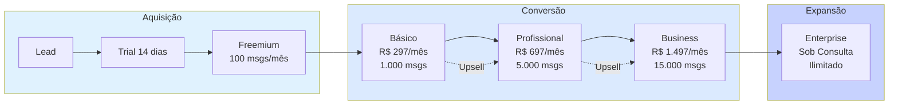

### Métricas SaaS Projetadas

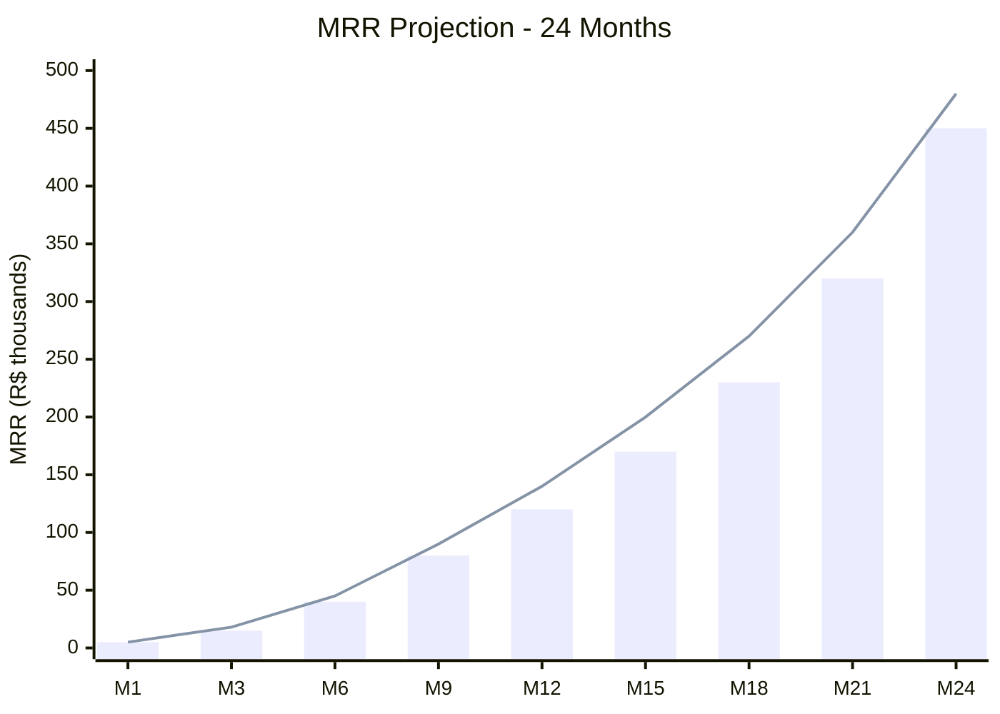

> **Projeção de MRR**: Barras mostram MRR realizado, linha mostra projeção otimista.

| Métrica | Mês 6 | Mês 12 | Mês 24 |
|---------|-------|--------|--------|
| **Clientes Ativos** | 80 | 200 | 600 |
| **MRR** | R$ 40.000 | R$ 120.000 | R$ 450.000 |
| **ARR** | R$ 480.000 | R$ 1.44M | R$ 5.4M |
| **Churn Mensal** | 5% | 3% | 2% |
| **CAC** | R$ 500 | R$ 400 | R$ 350 |
| **LTV** | R$ 4.000 | R$ 8.000 | R$ 15.000 |
| **LTV/CAC** | 8x | 20x | 43x |

---

## 🏢 Modelo 3: Agência/Revenda (White-Label)

### Estrutura de Parceria

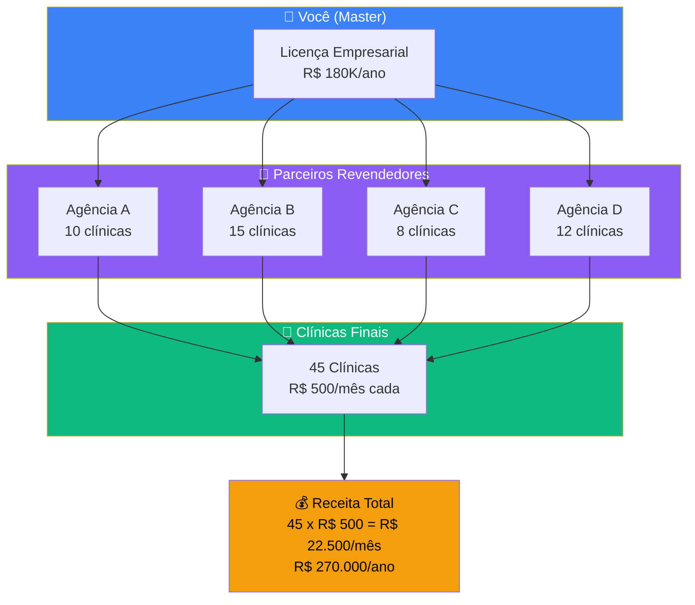

### Modelo de Revenue Share

| Componente | Você Recebe | Parceiro Recebe |
|------------|-------------|-----------------|
| **Setup Inicial** | 20% | 80% |
| **Mensalidade** | 30% | 70% |
| **Suporte N2/N3** | 100% | 0% |
| **Customizações** | 50% | 50% |

---

## 💡 Modelo 4: Consultoria + Software

### Pacotes de Serviço

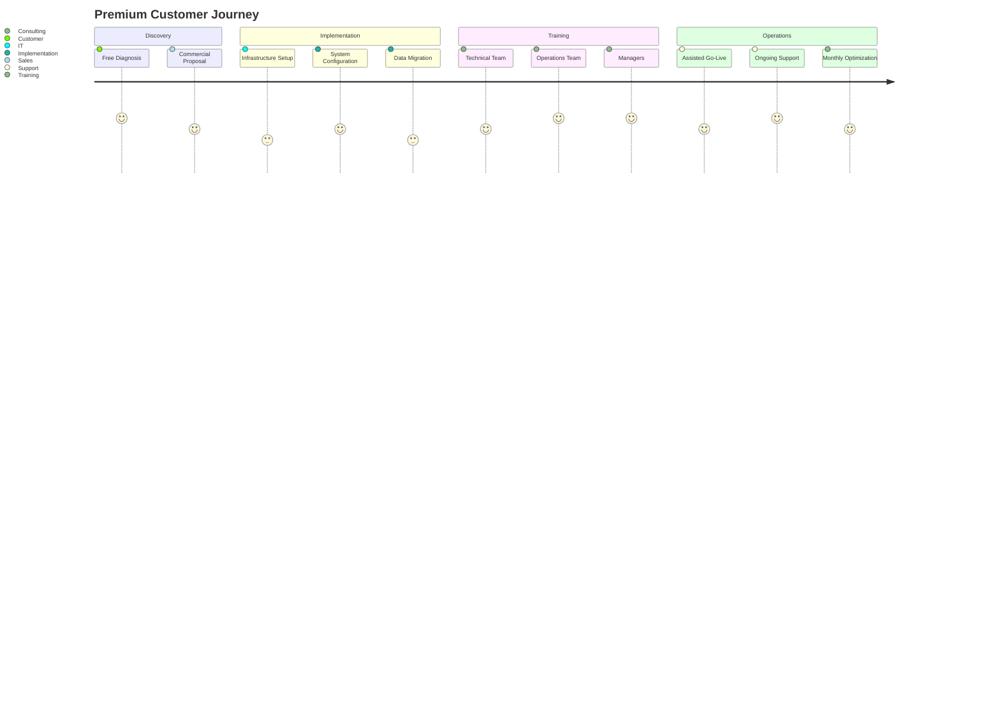

> **Jornada do Cliente Premium**: Descoberta → Implantação → Treinamento → Operação

### Precificação de Pacotes

| Pacote | Inclui | Preço |
|--------|--------|-------|
| **Essencial** | Licença + Setup Básico + 2h Treinamento | R$ 15.000 |
| **Profissional** | Licença + Setup Completo + 8h Treinamento + 3 meses Suporte | R$ 45.000 |
| **Premium** | Licença Enterprise + Setup + Treinamento Ilimitado + 12 meses Suporte + Consultoria Mensal | R$ 150.000 |
| **Turnkey** | Tudo + Infraestrutura Gerenciada + SLA 99.9% + Gerente de Conta | R$ 300.000+ |

---

## 📉 Análise de Custos vs Receita

### Estrutura de Custos Operacionais

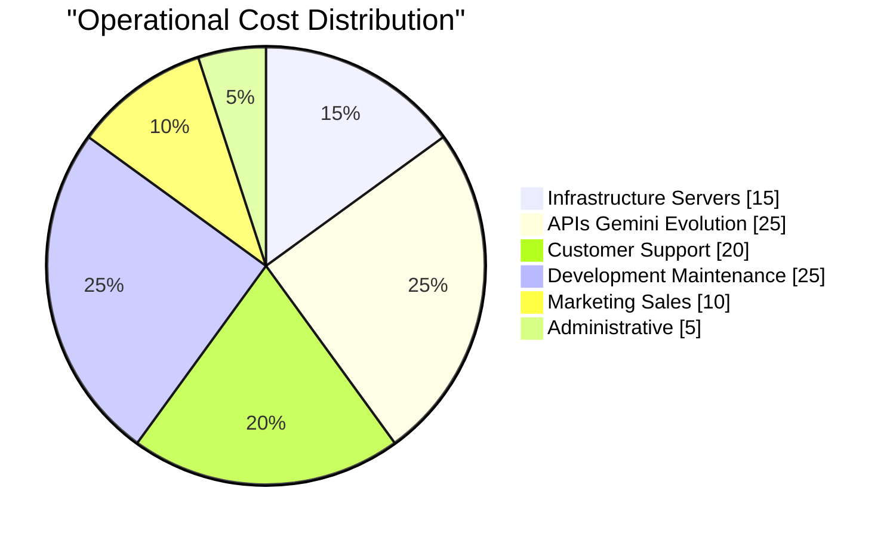

> **Distribuição de Custos Operacionais**: APIs (25%), Desenvolvimento (25%), Suporte (20%), Infra (15%), Marketing (10%), Admin (5%)

### Breakdown de Custos por Cliente (Mensal)

| Componente | Custo Unitário | Volume Médio | Custo Total |
|------------|----------------|--------------|-------------|
| **Servidor (rateado)** | R$ 0.50/cliente | 1 | R$ 0.50 |
| **Gemini API** | R$ 0.02/msg | 2.000 msgs | R$ 40.00 |
| **Evolution API** | R$ 0.01/msg | 2.000 msgs | R$ 20.00 |
| **Suporte (horas)** | R$ 50/hora | 0.5h | R$ 25.00 |
| **Infraestrutura Fixa** | R$ 200/mês | rateado | R$ 5.00 |
| **TOTAL** | - | - | **R$ 90.50** |

**Preço de Venda Recomendado**: R$ 497/mês → **Margem: 82%**

---

## 🎯 Estratégias de Aquisição de Clientes

### Funil de Vendas

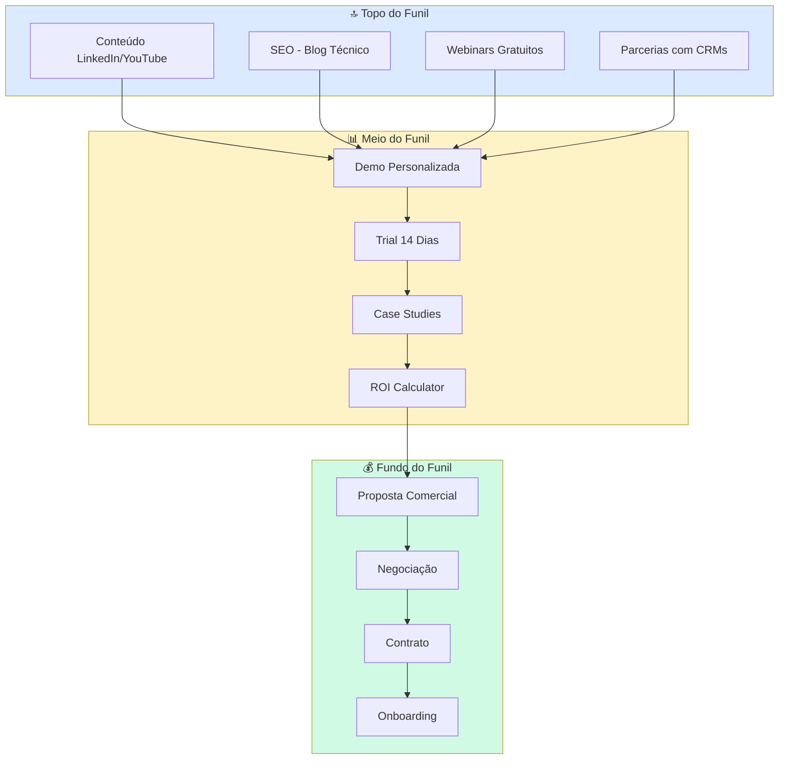

### Métricas de Aquisição Alvo

| Canal | CAC Alvo | Conversão | Volume/Mês |
|-------|----------|-----------|------------|
| **Indicações** | R$ 100 | 30% | 20 leads |
| **LinkedIn Ads** | R$ 400 | 5% | 100 leads |
| **Google Ads** | R$ 350 | 8% | 50 leads |
| **Parceiros** | R$ 200 | 15% | 30 leads |
| **Eventos/Webinars** | R$ 250 | 10% | 40 leads |

---

## 📊 ROI para o Cliente

### Demonstração de Valor

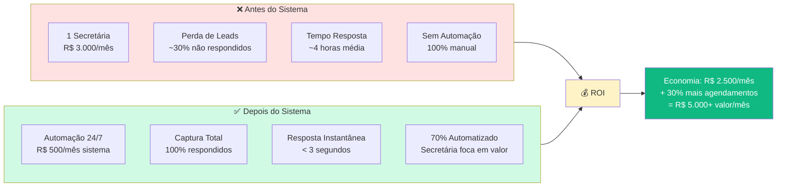

### Calculadora de ROI

| Métrica | Sem Sistema | Com Sistema | Diferença |
|---------|-------------|-------------|-----------|
| **Custo Mensal** | R$ 5.000 (2 funcionários) | R$ 3.500 (1 + sistema) | -R$ 1.500 |
| **Leads Respondidos** | 70% | 100% | +30% |
| **Taxa de Conversão** | 15% | 25% | +67% |
| **Agendamentos/Mês** | 100 | 150 | +50 |
| **Ticket Médio** | R$ 200 | R$ 200 | = |
| **Receita Mensal** | R$ 20.000 | R$ 30.000 | +R$ 10.000 |
| **ROI Mensal** | - | - | **2.000%** |

---

## 🚀 Roadmap de Monetização

### Timeline de Implementação

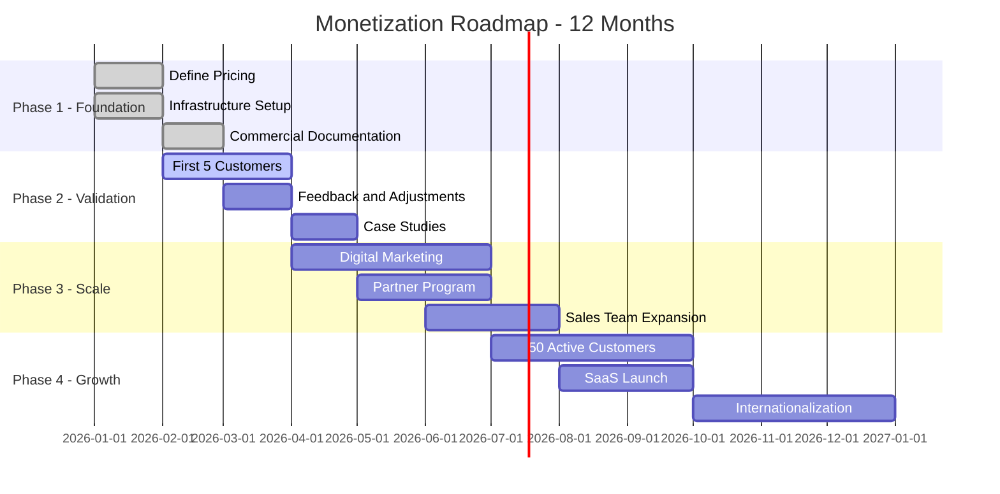

> **Roadmap de Monetização**: Fase 1 (Fundação) → Fase 2 (Validação) → Fase 3 (Escala) → Fase 4 (Crescimento)

---

## 📋 Checklist de Lançamento Comercial

### Pré-Lançamento
- [ ] Definir estrutura de preços final
- [ ] Criar landing page comercial
- [ ] Preparar material de vendas (deck, demos)
- [ ] Configurar processamento de pagamentos
- [ ] Setup CRM para pipeline de vendas
- [ ] Criar contrato padrão de licenciamento

### Lançamento
- [ ] Ativar campanhas de marketing
- [ ] Lançar programa de early adopters
- [ ] Publicar case studies iniciais
- [ ] Iniciar webinars semanais
- [ ] Ativar programa de afiliados

### Pós-Lançamento
- [ ] Monitorar métricas de conversão
- [ ] Coletar feedback de clientes
- [ ] Iterar no pricing se necessário
- [ ] Expandir funcionalidades baseado em demanda
- [ ] Escalar time de suporte

---

## 💼 Projeção Financeira - 3 Anos

### Cenário Conservador

| Ano | Clientes | MRR | ARR | Margem |
|-----|----------|-----|-----|--------|
| **Ano 1** | 30 | R$ 45K | R$ 540K | 70% |
| **Ano 2** | 100 | R$ 150K | R$ 1.8M | 75% |
| **Ano 3** | 300 | R$ 450K | R$ 5.4M | 80% |

### Cenário Otimista (com SaaS + Parceiros)

| Ano | Clientes | MRR | ARR | Margem |
|-----|----------|-----|-----|--------|
| **Ano 1** | 80 | R$ 120K | R$ 1.44M | 72% |
| **Ano 2** | 300 | R$ 450K | R$ 5.4M | 78% |
| **Ano 3** | 1.000 | R$ 1.5M | R$ 18M | 82% |

```mermaid
xychart-beta
    title "ARR Projection - 3 Years"
    x-axis ["Year 1", "Year 2", "Year 3"]
    y-axis "ARR (R$ Millions)" 0 --> 20
    bar "Conservative" [0.54, 1.8, 5.4]
    bar "Optimistic" [1.44, 5.4, 18]
```

> **Projeção de ARR**: Cenário Conservador vs Otimista em milhões de reais.

---

## 📞 Próximos Passos

1. **Defina seu modelo**: Escolha entre Licenciamento, SaaS ou Híbrido
2. **Valide pricing**: Teste com 3-5 clientes beta
3. **Construa assets**: Landing page, demo, materiais de vendas
4. **Lance MVP comercial**: Foque em um nicho específico primeiro
5. **Itere rapidamente**: Ajuste baseado em feedback real

---

**Versão do Documento**: 1.0  
**Última Atualização**: 03-01-2026  
**Classificação**: Proprietário e Confidencial

---

*"O valor não está no código, está no problema que você resolve."*

