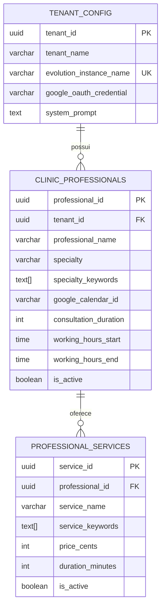

# 🏥 Arquitetura Multi-Profissional de Clínicas

## Visão Geral

Este documento descreve o design arquitetural para suporte a **Clínicas Multi-Profissional** - clínicas que usam um único número de WhatsApp (uma instância Evolution API) mas possuem **múltiplos profissionais**, cada um com seu próprio Google Calendar.

---

## 🎯 Declaração do Problema

### Cenário de Negócio
- **Uma clínica** = Um número de WhatsApp
- **Uma secretária** = Uma instância Evolution API
- **Múltiplos profissionais** = Dr. Silva, Dra. Costa, Dr. Santos
- **Conta Google compartilhada** = Uma credencial OAuth
- **Calendários separados** = Cada médico tem seu próprio calendário

### Desafio Técnico
A arquitetura original assumia `1 Clínica = 1 Calendário`:

```
tenant_config
├── google_calendar_id (ÚNICO)  ← Problema!
└── mcp_calendar_endpoint (ÚNICO)
```

O agente IA não tinha como:
1. Perguntar "Com qual médico você deseja?"
2. Rotear para o calendário correto
3. Prevenir conflitos de agendamento entre médicos

---

## 🏗️ Solução Arquitetural

### Diagrama de Entidade-Relacionamento (ERD)



### Decisões Chave de Design

| Decisão | Justificativa |
|---------|---------------|
| **Credencial OAuth Compartilhada** | Todos os profissionais compartilham a mesma conta Google (um login). O token OAuth é armazenado uma vez no nível do tenant. |
| **IDs de Calendário Individuais** | Cada profissional tem seu próprio `google_calendar_id` dentro da conta compartilhada. Google permite múltiplos calendários em uma conta. |
| **Array de Keywords de Especialidade** | A IA usa correspondência de keywords para rotear "coração" → "Cardiologista" → Dr. Silva |
| **Mapeamento Serviço-para-Profissional** | "Botox" é explicitamente mapeado para Dra. Costa. A IA não pode oferecer outros médicos para este serviço. |

---

## 📊 Schema do Banco de Dados

### Tabela: `clinic_professionals`

```sql
CREATE TABLE clinic_professionals (
    professional_id UUID PRIMARY KEY DEFAULT gen_random_uuid(),
    tenant_id UUID NOT NULL REFERENCES tenant_config(tenant_id),
    
    -- Identidade
    professional_name VARCHAR(200) NOT NULL,
    professional_slug VARCHAR(100) NOT NULL,
    specialty VARCHAR(200) NOT NULL,
    specialty_keywords TEXT[],  -- ['cardiologia', 'coração', 'pressão']
    
    -- Config de Calendário (INDIVIDUAL)
    google_calendar_id VARCHAR(255) NOT NULL,
    google_calendar_label VARCHAR(100),
    
    -- Agendamento
    consultation_duration_default INTEGER DEFAULT 30,
    buffer_time_minutes INTEGER DEFAULT 10,
    working_hours_start TIME,
    working_hours_end TIME,
    working_days JSONB DEFAULT '["1","2","3","4","5"]',
    
    -- Status
    is_active BOOLEAN DEFAULT true,
    display_order INTEGER DEFAULT 0,
    
    UNIQUE(tenant_id, professional_slug),
    UNIQUE(tenant_id, google_calendar_id)
);
```

### Tabela: `professional_services`

```sql
CREATE TABLE professional_services (
    service_id UUID PRIMARY KEY DEFAULT gen_random_uuid(),
    professional_id UUID NOT NULL REFERENCES clinic_professionals(professional_id),
    
    -- Info do Serviço
    service_name VARCHAR(200) NOT NULL,
    service_slug VARCHAR(100) NOT NULL,
    service_description TEXT,
    service_keywords TEXT[],  -- ['botox', 'toxina', 'rugas']
    
    -- Precificação
    price_cents INTEGER NOT NULL,
    duration_minutes INTEGER DEFAULT 30,
    
    -- Status
    is_active BOOLEAN DEFAULT true,
    
    UNIQUE(professional_id, service_slug)
);
```

---

## 🔄 Lógica de Workflow: Seleção de Profissional

### Diagrama de Fluxo

```mermaid
flowchart TD
    START([Mensagem do Usuário]) --> PARSE[Processar Webhook]
    PARSE --> LOAD[Carregar Config Tenant<br/>+ Lista de Profissionais]
    
    LOAD --> INTENT{Classificar Intenção}
    
    INTENT -->|Agendamento| EXTRACT[Extrair Entidades]
    INTENT -->|Outro| AI_DIRECT[Processamento IA Padrão]
    
    EXTRACT --> DETECT{Detectar Referência<br/>a Profissional}
    
    DETECT -->|Nome Mencionado<br/>"Dr. Silva"| LOOKUP_NAME[Buscar por Nome]
    DETECT -->|Especialidade Mencionada<br/>"Cardiologista"| LOOKUP_SPECIALTY[Buscar por Especialidade]
    DETECT -->|Serviço Mencionado<br/>"Botox"| LOOKUP_SERVICE[Buscar por Serviço]
    DETECT -->|Ambíguo<br/>"Quero consulta"| ASK_USER[IA Pergunta ao Usuário]
    
    LOOKUP_NAME --> FOUND{Encontrado?}
    LOOKUP_SPECIALTY --> FOUND
    LOOKUP_SERVICE --> FOUND
    
    FOUND -->|Sim, Único| SET_CALENDAR[Definir calendar_id<br/>deste profissional]
    FOUND -->|Sim, Múltiplos| LIST_OPTIONS[Listar opções para usuário]
    FOUND -->|Não| ASK_USER
    
    LIST_OPTIONS --> WAIT_USER[Aguardar escolha do usuário]
    ASK_USER --> WAIT_USER
    
    WAIT_USER --> SET_CALENDAR
    
    SET_CALENDAR --> CHECK_AVAIL[Verificar Disponibilidade<br/>no Calendário ESPECÍFICO]
    CHECK_AVAIL --> CREATE_EVENT[Criar Evento<br/>no Calendário ESPECÍFICO]
    CREATE_EVENT --> CONFIRM[Confirmar para Usuário]
    
    style SET_CALENDAR fill:#4caf50,color:#fff
    style ASK_USER fill:#ff9800,color:#fff
    style CHECK_AVAIL fill:#2196f3,color:#fff
```

### Funções de Busca

O banco de dados fornece três funções de busca:

```sql
-- Encontrar profissional por keywords de especialidade
SELECT * FROM find_professional_by_specialty(
    p_tenant_id := 'uuid-aqui',
    p_search_text := 'cardiologista'
);

-- Encontrar profissional por serviço
SELECT * FROM find_professional_by_service(
    p_tenant_id := 'uuid-aqui',
    p_search_text := 'botox'
);

-- Obter todos os profissionais para listagem
SELECT * FROM get_tenant_professionals(
    p_tenant_id := 'uuid-aqui'
);
```

---

## 🤖 Configuração do Agente IA

### System Prompt Atualizado

O system prompt DEVE incluir:

```
PROFISSIONAIS DISPONÍVEIS:
{{ professionals_list }}

REGRAS CRÍTICAS DE AGENDAMENTO:
⚠️ NUNCA agende sem confirmar o profissional primeiro
⚠️ NUNCA misture agendas - cada médico tem seu próprio calendar_id
⚠️ Se o serviço é exclusivo (ex: Botox = Dra. Costa), não ofereça outros
⚠️ SEMPRE confirme com o paciente ANTES de criar o evento

FLUXO DE DETERMINAÇÃO DO PROFISSIONAL:
1. Se o paciente mencionar especialidade → Identifique o profissional
2. Se o paciente mencionar serviço → Identifique quem oferece
3. Se o paciente mencionar nome → Use esse profissional
4. SE AMBÍGUO → PERGUNTE: "Com qual profissional você gostaria?"
```

### Prevenção de Prompt Injection

Para prevenir que a IA agende paciente do Dr. Silva no calendário do Dr. Santos:

```
ANTES DE CRIAR EVENTO:
1. Confirme: "Vou agendar com [NOME DO PROFISSIONAL]. Está correto?"
2. Use SOMENTE o calendar_id do profissional confirmado
3. Na descrição do evento, INCLUA o nome do profissional

VALIDAÇÃO:
- calendar_id DEVE corresponder ao profissional selecionado
- Se o usuário mudar de ideia, reinicie o processo de seleção
```

---

## 📅 Adaptação da Ferramenta Google Calendar

### Problema Atual

```javascript
// ANTES: Calendário hardcoded da config do tenant
"sseEndpoint": "={{ $json.tenant_config.mcp_calendar_endpoint }}"
```

### Solução: Calendar ID Dinâmico

A ferramenta MCP Calendar precisa aceitar um parâmetro **`calendarId` dinâmico**:

```javascript
// DEPOIS: Calendário dinâmico do profissional selecionado
{
  "parameters": {
    "sseEndpoint": "={{ $json.tenant_config.mcp_calendar_endpoint }}",
    "toolParameters": {
      "calendarId": "={{ $json.selected_professional.google_calendar_id }}",
      "operation": "={{ $json.calendar_operation }}",
      "eventData": "={{ $json.event_data }}"
    }
  }
}
```

### Estratégia de Implementação

**Opção A: Modificar Endpoint MCP** (Recomendado)
- O serviço MCP Calendar aceita `calendarId` como parâmetro
- O agente IA passa o `google_calendar_id` do profissional dinamicamente

**Opção B: Múltiplas Instâncias de Ferramenta**
- Crie uma ferramenta MCP por profissional
- Agente IA seleciona a ferramenta correta baseado no profissional

**Opção C: Sub-Workflow Wrapper**
- Crie um sub-workflow "Calendar Router"
- Recebe: `professional_id`, `operation`, `event_data`
- Roteia para calendário correto baseado na config do profissional

---

## 🔧 Checklist de Implementação

### Mudanças no Banco de Dados
- [x] Criar tabela `clinic_professionals`
- [x] Criar tabela `professional_services`
- [x] Criar funções de busca (`find_professional_by_*`)
- [x] Criar função aprimorada `get_tenant_with_professionals`
- [x] Adicionar `google_oauth_credential_id` ao `tenant_config`

### Mudanças em Workflows
- [ ] Atualizar `tenant-config-loader` para usar `get_tenant_with_professionals`
- [ ] Adicionar lógica "Seleção de Profissional" ao workflow principal
- [ ] Modificar ferramenta MCP Calendar para aceitar `calendarId` dinâmico
- [ ] Atualizar system prompt com lista de profissionais

### Configuração da IA
- [x] Template de system prompt atualizado com regras multi-profissional
- [ ] Adicionar exemplos de conversas para tratamento de ambiguidade
- [ ] Testar seleção de profissional com várias entradas

---

## 📋 Exemplos de Conversas

### Exemplo 1: Solicitação Clara de Especialidade

```
Paciente: Preciso de um cardiologista
Bot: Olá! Temos o Dr. João Silva, nosso Cardiologista. 
     Para agendar uma consulta com ele, preciso de algumas informações:
     - Nome completo
     - Data de nascimento
     - Telefone para contato
```

### Exemplo 2: Solicitação Baseada em Serviço

```
Paciente: Quero fazer botox
Bot: Perfeito! O procedimento de Botox é realizado pela Dra. Maria Costa, 
     nossa Dermatologista.
     O valor é R$ 1.200,00 e a sessão dura aproximadamente 45 minutos.
     Gostaria de agendar um horário?
```

### Exemplo 3: Solicitação Ambígua

```
Paciente: Quero marcar uma consulta
Bot: Claro! Para agendar sua consulta, com qual profissional você 
     gostaria de ser atendido(a)?
     
     Temos:
     • Dr. João Silva - Cardiologista
     • Dra. Maria Costa - Dermatologista
     • Dr. Pedro Santos - Clínico Geral
```

### Exemplo 4: Solicitação Baseada em Nome

```
Paciente: Quero consulta com Dr. Santos
Bot: Ótimo! Dr. Pedro Santos é nosso Clínico Geral.
     Para agendar com ele, preciso de algumas informações...
```

---

## 🚨 Tratamento de Erros

### Profissional Desconhecido
```javascript
if (!selectedProfessional) {
    return {
        error: true,
        message: "Não encontrei esse profissional. Nossos profissionais são: [lista]"
    };
}
```

### Serviço Não Oferecido
```javascript
if (!serviceMatch) {
    return {
        error: true,
        message: "Esse serviço não está disponível. Oferecemos: [lista de serviços]"
    };
}
```

### Prevenção de Descasamento de Calendário
```javascript
if (event.calendarId !== selectedProfessional.google_calendar_id) {
    throw new Error("SEGURANÇA: Tentativa de agendar em calendário errado");
}
```

---

## 📈 Impacto nos Custos

| Cenário | Antes (Calendário Único) | Depois (Multi-Profissional) |
|---------|-------------------------|----------------------------|
| Query Simples | 1 chamada IA | 1 chamada IA |
| Query Ambígua | 1 chamada IA (risco de agendamento errado) | 1 chamada IA + 1 clarificação |
| Baseado em Serviço | 1 chamada IA | 1 busca BD + 1 chamada IA |
| **Segurança Geral** | ⚠️ Risco de calendário errado | ✅ Agendamento validado |

---

## 🔮 Melhorias Futuras

1. **Matriz de Disponibilidade de Profissional**: Pré-calcular disponibilidade semanal por profissional
2. **Roteamento Inteligente**: IA aprende qual profissional é preferido para certos sintomas
3. **Suporte Multi-Localização**: Mesmo profissional, diferentes filiais da clínica
4. **Agendamento em Equipe**: Agendamentos em grupo (ex: consulta + exame no mesmo dia)

---

## 📁 Arquivos Relacionados

- `/scripts/migrations/004_create_professionals_tables.sql` - Schema do banco
- `/scripts/migrations/005_seed_professionals_data.sql` - Dados de exemplo
- `/workflows/sub/tenant-config-loader.json` - Precisa atualização para profissionais
- `/workflows/main/01-whatsapp-patient-handler-optimized.json` - Workflow principal

---

*Última Atualização: 01-01-2026*
*Versão da Arquitetura: 2.0 (Multi-Profissional)*
