# 📈 Guia de Escalabilidade

> **Documentação Proprietária**  
> Copyright © 2026. Todos os Direitos Reservados.  
> Arquitetura de escalabilidade para o Sistema Multi-Agente de Gestão de Clínicas.

---

## 🎯 Visão Geral

Este documento detalha as estratégias de escalabilidade do sistema, desde uma única clínica até operações enterprise com milhares de tenants.

### Níveis de Escala

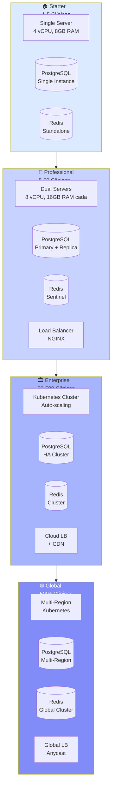

---

## 📊 Métricas de Capacidade por Tier

### Tabela de Capacidade

| Tier | Tenants | Mensagens/Mês | Conexões Simultâneas | Custo Infra/Mês |
|------|---------|---------------|----------------------|-----------------|
| **Starter** | 1-5 | 10.000 | 50 | R$ 200-500 |
| **Professional** | 5-50 | 100.000 | 500 | R$ 1.000-3.000 |
| **Enterprise** | 50-500 | 1.000.000 | 5.000 | R$ 5.000-15.000 |
| **Global** | 500+ | 10.000.000+ | 50.000+ | R$ 20.000+ |

### Diagrama de Recursos por Tier

```mermaid
xychart-beta
    title "Resource Requirements by Number of Tenants"
    x-axis ["5", "20", "50", "100", "200", "500"]
    y-axis "Resources (relative units)" 0 --> 100
    bar "CPU (vCPU)" [4, 8, 16, 32, 64, 128]
    bar "RAM (GB)" [8, 16, 32, 64, 128, 256]
    line "Cost (R$ k/month)" [0.5, 2, 5, 10, 20, 50]
```

> **Requisitos de Recursos**: CPU, RAM e Custo escalam conforme número de tenants.

---

## 🏗️ Arquitetura por Nível de Escala

### Nível 1: Starter (1-5 Clínicas)

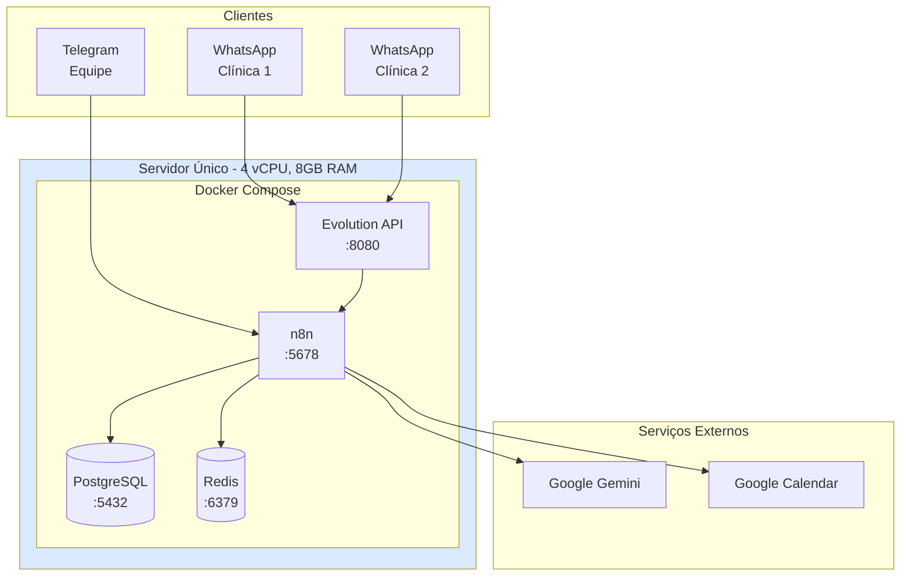

**Especificações:**
- **CPU**: 4 vCPU (2.4GHz+)
- **RAM**: 8 GB
- **Disco**: 50 GB SSD
- **Rede**: 100 Mbps
- **Custo**: R$ 200-500/mês (VPS)

**Configuração Docker:**
```yaml
# docker-compose.yaml - Starter
services:
  n8n:
    deploy:
      resources:
        limits:
          cpus: '2'
          memory: 4G
        reservations:
          memory: 2G
          
  postgres:
    deploy:
      resources:
        limits:
          cpus: '1'
          memory: 2G
          
  redis:
    command: >
      redis-server
      --maxmemory 256mb
      --maxmemory-policy allkeys-lru
```

---

### Nível 2: Professional (5-50 Clínicas)

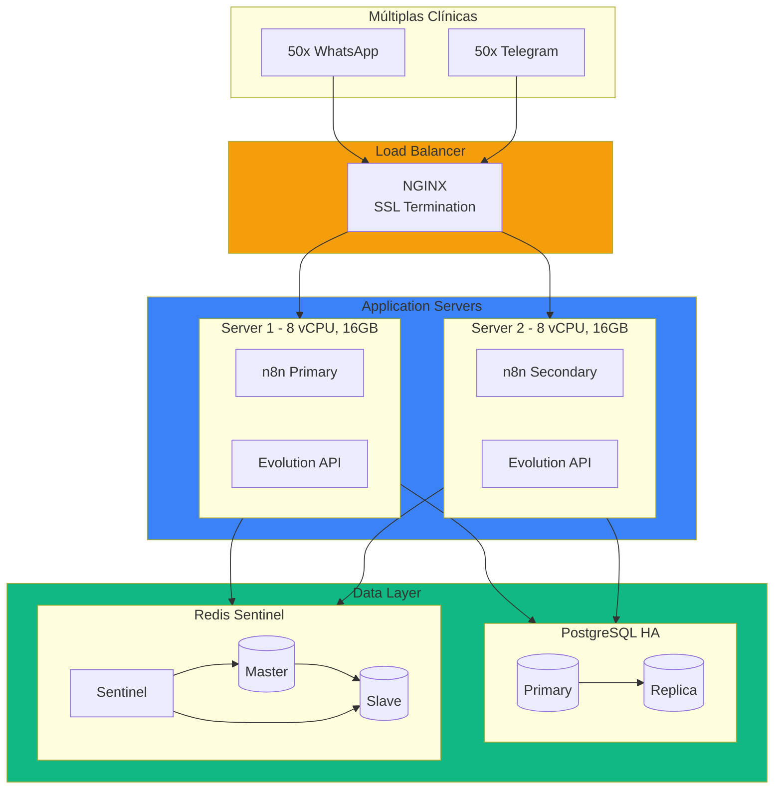

**Especificações:**
- **App Servers**: 2x (8 vCPU, 16 GB RAM)
- **Database**: PostgreSQL 14+ com streaming replication
- **Cache**: Redis Sentinel (3 nodes)
- **Load Balancer**: NGINX com health checks
- **Custo**: R$ 1.000-3.000/mês

**Configuração PostgreSQL HA:**
```sql
-- primary postgresql.conf
wal_level = replica
max_wal_senders = 3
synchronous_commit = on
synchronous_standby_names = 'replica1'

-- replica recovery.conf
standby_mode = 'on'
primary_conninfo = 'host=primary port=5432 user=replicator'
trigger_file = '/tmp/postgresql.trigger'
```

---

### Nível 3: Enterprise (50-500 Clínicas)

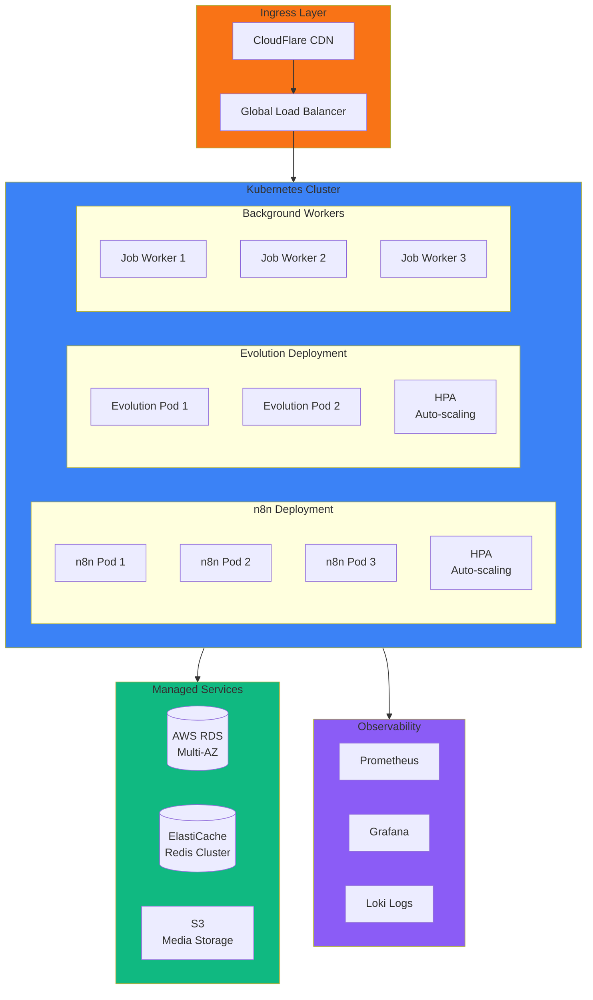

**Especificações Kubernetes:**
```yaml
# n8n-deployment.yaml
apiVersion: apps/v1
kind: Deployment
metadata:
  name: n8n
spec:
  replicas: 3
  selector:
    matchLabels:
      app: n8n
  template:
    spec:
      containers:
      - name: n8n
        image: n8nio/n8n:latest
        resources:
          requests:
            memory: "2Gi"
            cpu: "1000m"
          limits:
            memory: "4Gi"
            cpu: "2000m"
        env:
        - name: EXECUTIONS_MODE
          value: "queue"
        - name: QUEUE_BULL_REDIS_HOST
          value: "redis-cluster"
---
apiVersion: autoscaling/v2
kind: HorizontalPodAutoscaler
metadata:
  name: n8n-hpa
spec:
  scaleTargetRef:
    apiVersion: apps/v1
    kind: Deployment
    name: n8n
  minReplicas: 3
  maxReplicas: 20
  metrics:
  - type: Resource
    resource:
      name: cpu
      target:
        type: Utilization
        averageUtilization: 70
  - type: Resource
    resource:
      name: memory
      target:
        type: Utilization
        averageUtilization: 80
```

**Custo Estimado AWS:**
| Serviço | Configuração | Custo/Mês |
|---------|--------------|-----------|
| EKS Cluster | 1 cluster | R$ 400 |
| EC2 (Workers) | 6x m5.xlarge | R$ 4.000 |
| RDS PostgreSQL | db.r5.xlarge Multi-AZ | R$ 3.000 |
| ElastiCache | cache.r5.large (3 nodes) | R$ 1.500 |
| ALB | 1 Application LB | R$ 200 |
| S3 + CloudFront | 100GB + CDN | R$ 300 |
| **TOTAL** | | **R$ 9.400** |

---

### Nível 4: Global (500+ Clínicas)

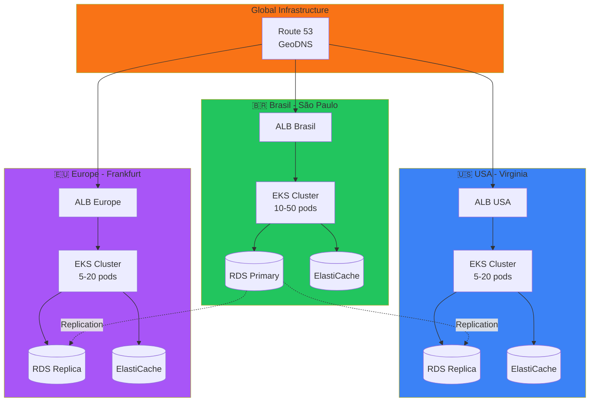

**Arquitetura Multi-Region:**
- **Primary Region**: Brasil (São Paulo) - Todas as escritas
- **Read Replicas**: USA, Europa - Leituras locais
- **Failover**: Automático via Route 53 health checks
- **Latência**: < 100ms para usuários globais

---

## 🔄 Estratégias de Escalabilidade

### Escalabilidade Horizontal vs Vertical

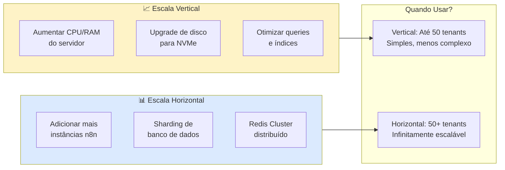

### Padrões de Escalabilidade do n8n

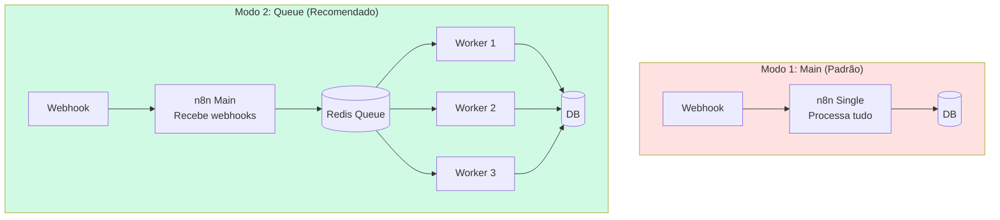

**Configuração Queue Mode:**
```bash
# n8n Main (recebe webhooks)
EXECUTIONS_MODE=queue
QUEUE_BULL_REDIS_HOST=redis

# n8n Workers (processam execuções)
EXECUTIONS_MODE=queue
QUEUE_BULL_REDIS_HOST=redis
N8N_DISABLE_UI=true
```

---

## 📊 Otimização de Banco de Dados

### Estratégia de Indexação

```sql
-- Índices críticos para performance em escala
-- tenant_config: Busca por instance_name (mais frequente)
CREATE INDEX CONCURRENTLY idx_tenant_config_instance 
ON tenant_config(evolution_instance_name) 
WHERE is_active = true;

-- tenant_faq: Busca por keywords (FAQ cache)
CREATE INDEX CONCURRENTLY idx_tenant_faq_keywords 
ON tenant_faq USING GIN(keywords);

-- tenant_faq: Busca por question normalizada
CREATE INDEX CONCURRENTLY idx_tenant_faq_question 
ON tenant_faq USING GIN(to_tsvector('portuguese', question_normalized));

-- professional_services: Busca por serviço
CREATE INDEX CONCURRENTLY idx_prof_services_keywords 
ON professional_services USING GIN(service_keywords);

-- Índice composto para chat memory
CREATE INDEX CONCURRENTLY idx_chat_memory_session 
ON chat_memory(tenant_id, session_id, created_at DESC);
```

### Particionamento de Tabelas

```sql
-- Para tabelas de alto volume, usar particionamento por tenant
CREATE TABLE chat_memory (
    id UUID NOT NULL,
    tenant_id UUID NOT NULL,
    session_id VARCHAR(255),
    message TEXT,
    role VARCHAR(50),
    created_at TIMESTAMPTZ DEFAULT NOW()
) PARTITION BY HASH (tenant_id);

-- Criar partições
CREATE TABLE chat_memory_p0 PARTITION OF chat_memory 
FOR VALUES WITH (MODULUS 4, REMAINDER 0);

CREATE TABLE chat_memory_p1 PARTITION OF chat_memory 
FOR VALUES WITH (MODULUS 4, REMAINDER 1);

CREATE TABLE chat_memory_p2 PARTITION OF chat_memory 
FOR VALUES WITH (MODULUS 4, REMAINDER 2);

CREATE TABLE chat_memory_p3 PARTITION OF chat_memory 
FOR VALUES WITH (MODULUS 4, REMAINDER 3);
```

### Query Performance por Escala

```mermaid
xychart-beta
    title "Query Time by Number of Records"
    x-axis ["10K", "100K", "1M", "10M", "100M"]
    y-axis "Time (ms)" 0 --> 1000
    bar "No Index" [5, 50, 500, 5000, 50000]
    bar "With Index" [1, 2, 5, 15, 50]
    bar "Partitioned" [1, 1, 2, 5, 15]
```

> **Tempo de Query**: Comparativo entre sem índice, com índice e particionado.

---

## 🔄 Cache Strategy

### Arquitetura de Cache Multi-Camada

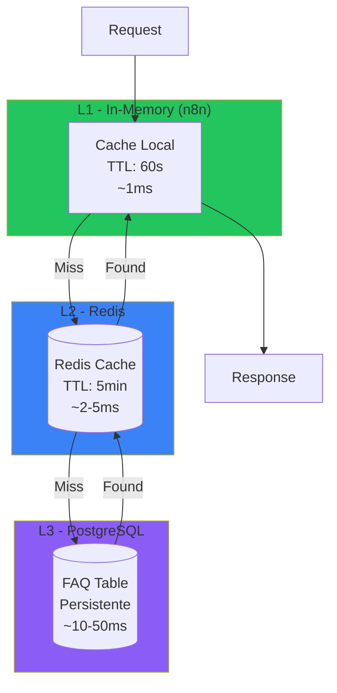

### Configuração Redis para Alta Disponibilidade

```bash
# redis-cluster.conf
cluster-enabled yes
cluster-config-file nodes.conf
cluster-node-timeout 5000
appendonly yes
maxmemory 2gb
maxmemory-policy allkeys-lfu

# Sharding automático
# 6 nodes: 3 masters + 3 replicas
redis-cli --cluster create \
  node1:6379 node2:6379 node3:6379 \
  node4:6379 node5:6379 node6:6379 \
  --cluster-replicas 1
```

---

## 📈 Monitoramento em Escala

### Stack de Observabilidade

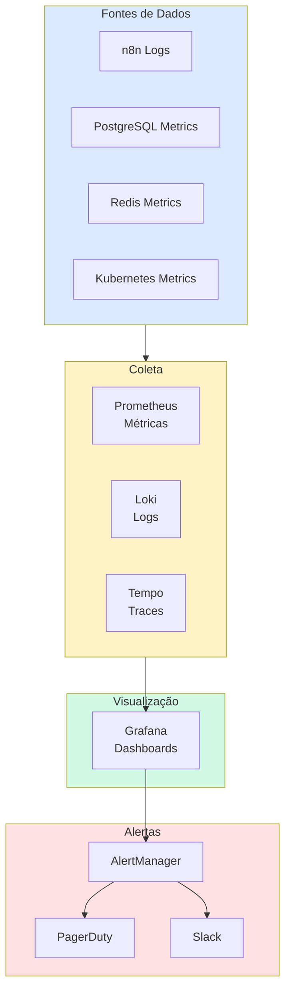

### Métricas Críticas para Monitorar

| Métrica | Limiar Warning | Limiar Critical | Ação |
|---------|----------------|-----------------|------|
| CPU n8n | > 70% | > 90% | Scale up pods |
| Memória n8n | > 75% | > 90% | Aumentar limits |
| Conexões DB | > 80% pool | > 95% pool | Aumentar pool |
| Redis Memory | > 70% | > 85% | Flush ou upgrade |
| Latência P99 | > 2s | > 5s | Investigar gargalo |
| Taxa de Erro | > 1% | > 5% | Alertar equipe |
| Fila de Jobs | > 100 | > 500 | Adicionar workers |

### Dashboard Grafana - Painel Principal

```json
{
  "dashboard": {
    "title": "Clinic System - Overview",
    "panels": [
      {
        "title": "Mensagens Processadas/min",
        "type": "stat",
        "datasource": "Prometheus",
        "targets": [{
          "expr": "rate(n8n_workflow_executions_total[5m]) * 60"
        }]
      },
      {
        "title": "Latência P99",
        "type": "gauge",
        "targets": [{
          "expr": "histogram_quantile(0.99, n8n_workflow_execution_duration_bucket)"
        }]
      },
      {
        "title": "Taxa de Acerto Cache FAQ",
        "type": "stat",
        "targets": [{
          "expr": "sum(faq_cache_hits) / sum(faq_cache_total) * 100"
        }]
      }
    ]
  }
}
```

---

## 🚨 Disaster Recovery

### Estratégia de Backup por Tier

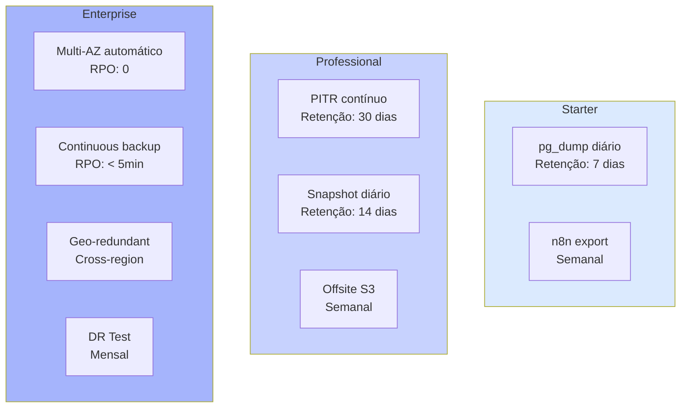

### RTO/RPO por Tier

| Tier | RPO | RTO | Método |
|------|-----|-----|--------|
| **Starter** | 24h | 4h | Restore manual |
| **Professional** | 1h | 1h | Automated failover |
| **Enterprise** | 0-5min | 15min | Multi-AZ + Auto-failover |
| **Global** | 0 | < 5min | Active-Active Multi-Region |

---

## 📋 Checklist de Escalabilidade

### Pré-Escala (Preparação)
- [ ] Implementar queue mode no n8n
- [ ] Configurar métricas Prometheus
- [ ] Setup alertas críticos
- [ ] Documentar runbooks de incidentes
- [ ] Testar procedimento de failover

### Durante Escala
- [ ] Monitorar métricas em tempo real
- [ ] Escalar banco ANTES de atingir limites
- [ ] Adicionar réplicas de leitura gradualmente
- [ ] Implementar rate limiting se necessário
- [ ] Otimizar queries mais lentas

### Pós-Escala
- [ ] Validar todas as funcionalidades
- [ ] Atualizar documentação de arquitetura
- [ ] Revisar custos vs projeção
- [ ] Planejar próximo threshold de escala
- [ ] Documentar lições aprendidas

---

## 💰 Custo por Escala

```mermaid
xychart-beta
    title "Infrastructure Cost vs Revenue (R$ k/month)"
    x-axis ["5 tenants", "20 tenants", "50 tenants", "100 tenants", "500 tenants"]
    y-axis "R$ thousands" 0 --> 300
    bar "Infra Cost" [0.5, 2, 5, 15, 50]
    bar "Revenue" [2.5, 10, 35, 100, 250]
    line "Margin" [2, 8, 30, 85, 200]
```

> **Custo vs Receita**: Infraestrutura, Receita e Margem por escala de tenants.

| Escala | Custo Infra | Receita Potencial | Margem |
|--------|-------------|-------------------|--------|
| 5 tenants | R$ 500 | R$ 2.500 | 80% |
| 20 tenants | R$ 2.000 | R$ 10.000 | 80% |
| 50 tenants | R$ 5.000 | R$ 35.000 | 86% |
| 100 tenants | R$ 15.000 | R$ 100.000 | 85% |
| 500 tenants | R$ 50.000 | R$ 250.000 | 80% |

---

**Versão do Documento**: 1.0  
**Última Atualização**: 03-01-2026  
**Classificação**: Proprietário e Confidencial

