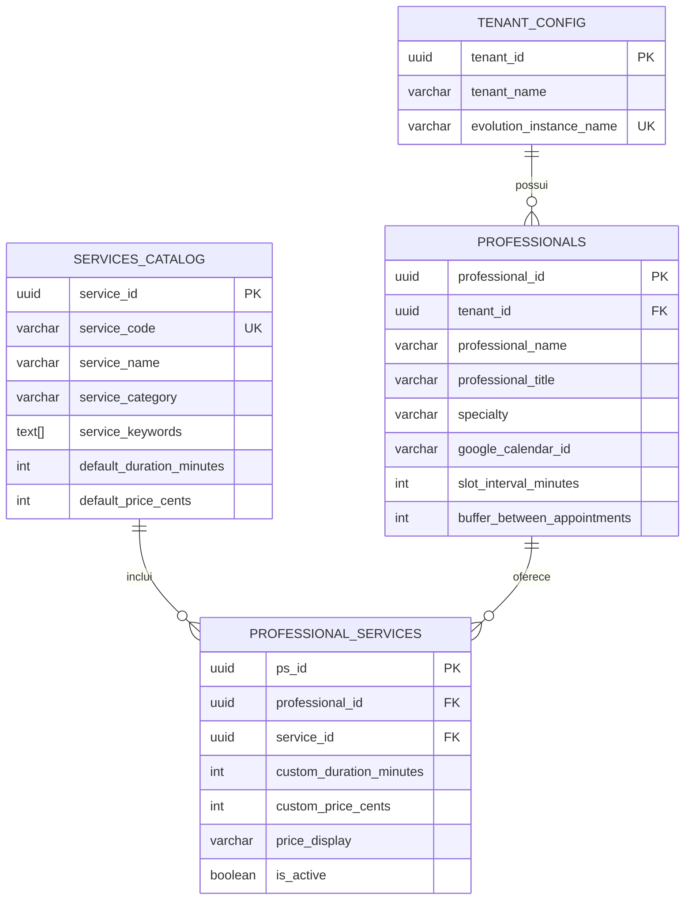

# 🏥 Arquitetura do Service Resolver - Guia Definitivo

## Visão Geral

Este documento descreve a arquitetura **Multi-Profissional e Multi-Serviço** para lidar com durações dinâmicas de serviços, precificação e roteamento de calendário. Este é o design definitivo que substitui o modelo multi-profissional mais simples.

---

## 🎯 Declaração do Problema

### O Cenário "Dr. José"

```
CLÍNICA: Clínica Moreira (1 WhatsApp, 1 Conta Google)

DR. JOSÉ (Dentista):
├── Implante Dentário → 2 horas, R$ 5.000
└── Botox → 1.5 horas, R$ 500

DRA. MARIA (Dermatologista):
└── Botox → 1 hora, R$ 600  ← Duração e preço DIFERENTES!
```

### Desafios Técnicos

| Desafio | Descrição |
|---------|-----------|
| **Cálculo de Slot** | IA não pode oferecer 14h-15h para procedimento de 2 horas |
| **Duração Dinâmica** | Mesmo serviço (Botox) tem durações diferentes por profissional |
| **Precificação Dinâmica** | Mesmo serviço tem preços diferentes por profissional |
| **Roteamento de Calendário** | Deve agendar no calendário correto do profissional |
| **Cálculo do Horário Final** | `hora_fim = hora_inicio + duracao_personalizada` |

---

## 🏗️ Arquitetura do Banco de Dados

### Diagrama de Entidade-Relacionamento



### Definições das Tabelas

#### `services_catalog` (Definições Globais de Serviços)

```sql
CREATE TABLE services_catalog (
    service_id UUID PRIMARY KEY,
    service_code VARCHAR(50) UNIQUE,     -- 'IMPLANT_DENTAL'
    service_name VARCHAR(200),           -- 'Implante Dentário'
    service_category VARCHAR(100),       -- 'Odontologia'
    service_keywords TEXT[],             -- ['implante', 'dente', 'prótese']
    default_duration_minutes INTEGER,    -- Padrão: 120
    default_price_cents INTEGER          -- Padrão: 500000
);
```

#### `professionals` (Equipe da Clínica)

```sql
CREATE TABLE professionals (
    professional_id UUID PRIMARY KEY,
    tenant_id UUID REFERENCES tenant_config,
    professional_name VARCHAR(200),      -- 'José Silva'
    professional_title VARCHAR(50),      -- 'Dr.'
    specialty VARCHAR(200),              -- 'Dentista - Implantodontista'
    google_calendar_id VARCHAR(255),     -- Calendário individual
    slot_interval_minutes INTEGER,       -- 30 (granularidade)
    buffer_between_appointments INTEGER  -- 15 (min entre agendamentos)
);
```

#### `professional_services` (Tabela de Junção - CRÍTICA)

```sql
CREATE TABLE professional_services (
    ps_id UUID PRIMARY KEY,
    professional_id UUID REFERENCES professionals,
    service_id UUID REFERENCES services_catalog,
    
    -- ═══════════════════════════════════════════════════════════
    -- CRÍTICO: Estes SOBRESCREVEM os padrões do catálogo
    -- ═══════════════════════════════════════════════════════════
    custom_duration_minutes INTEGER NOT NULL,  -- Dr. José: 120 min
    custom_price_cents INTEGER NOT NULL,       -- Dr. José: R$ 5.000
    price_display VARCHAR(50),                 -- 'R$ 5.000,00'
    
    UNIQUE(professional_id, service_id)
);
```

---

## 🔄 Lógica do Service Resolver

### Fluxo Completo

```mermaid
flowchart TD
    START([Usuário: "Quero fazer implante"]) --> EXTRACT[1. Extrair Intenção<br/>Intenção = 'implante']
    
    EXTRACT --> LOOKUP[2. Busca no Banco<br/>find_professionals_for_service]
    
    LOOKUP --> RESULT{Resultados?}
    
    RESULT -->|Único Profissional| PRESENT_ONE[Apresentar ao Usuário:<br/>"Dr. José faz Implante<br/>Duração: 2h | Valor: R$ 5.000"]
    
    RESULT -->|Múltiplos Profissionais| PRESENT_MANY[Apresentar Opções:<br/>"Dr. José - 2h, R$ 5k<br/>Dr. Ana - 1.5h, R$ 4k"]
    
    RESULT -->|Sem Resultados| ERROR[Informar Usuário:<br/>"Serviço não disponível"]
    
    PRESENT_ONE --> CONFIRM[3. Usuário Confirma]
    PRESENT_MANY --> SELECT[Usuário Seleciona Profissional]
    SELECT --> CONFIRM
    
    CONFIRM --> SLOT_REQUEST[4. Usuário Solicita Data/Hora<br/>"Amanhã às 14h"]
    
    SLOT_REQUEST --> VALIDATE[5. Validar Slot<br/>validate_slot_for_service]
    
    VALIDATE --> VALID{Slot >= Duração?}
    
    VALID -->|❌ 14h-15h < 2h| REJECT[Rejeitar Slot<br/>"Horário insuficiente.<br/>Preciso de 2h livres."]
    REJECT --> SUGGEST[Sugerir Alternativa:<br/>"Disponível 9h-11h"]
    
    VALID -->|✅ 14h-17h >= 2h| CALCULATE[6. Calcular Hora Fim<br/>fim = 14h + 120min = 16h]
    
    CALCULATE --> BOOK[7. Criar Evento no Calendário<br/>calendar_id: dr-jose-agenda@...<br/>inicio: 14:00<br/>fim: 16:00]
    
    BOOK --> RESPONSE([Confirmar ao Usuário:<br/>"Agendado com Dr. José<br/>14h às 16h | R$ 5.000"])
    
    style LOOKUP fill:#4285f4,color:#fff
    style VALIDATE fill:#ff9800,color:#fff
    style CALCULATE fill:#4caf50,color:#fff
    style BOOK fill:#4caf50,color:#fff
```

### Detalhamento Passo a Passo

#### Passo 1: Extrair Intenção (IA)

```javascript
// IA extrai a intenção de serviço da mensagem do usuário
const userMessage = "Quero fazer um implante";
const intent = await ai.extractIntent(userMessage);
// intent = "implante"
```

#### Passo 2: Busca no Banco de Dados

```sql
-- Encontrar profissionais que oferecem "implante"
SELECT * FROM find_professionals_for_service(
    p_tenant_id := 'tenant-uuid',
    p_search_text := 'implante'
);

-- Retorna:
-- professional_name | service_name      | duration_minutes | price_cents | google_calendar_id
-- Dr. José          | Implante Dentário | 120              | 500000      | dr-jose-agenda@...
```

#### Passo 3: Apresentar Informações ao Usuário

A IA DEVE apresentar:
- **Nome do profissional**
- **Duração do serviço** (em formato legível)
- **Preço do serviço** (formatado)

```
Bot: "O procedimento de Implante Dentário é realizado pelo Dr. José.
     
     📋 Detalhes:
     • Duração: 2 horas
     • Valor: R$ 5.000,00
     • Observação: Necessário jejum de 8 horas
     
     Gostaria de agendar?"
```

#### Passo 4: Validação de Slot (CRÍTICO)

Quando o usuário solicita um horário, valide se o slot pode acomodar o serviço:

```sql
-- Usuário quer "amanhã às 14h"
-- Verificar se há slot a partir das 14h que pode acomodar 2 horas

SELECT * FROM validate_slot_for_service(
    p_slot_start := '2026-01-03 14:00',
    p_slot_end := '2026-01-03 15:00',  -- Slot disponível termina às 15h
    p_professional_id := 'dr-jose-uuid',
    p_service_id := 'implant-uuid'
);

-- Retorna:
-- is_valid | slot_duration_minutes | required_duration_minutes | error_message
-- false    | 60                    | 120                       | "Slot muito curto: disponível 60 min, necessário 120 min"
```

#### Passo 5: Calcular Hora Fim

```sql
-- Calcular a hora fim correta
SELECT calculate_appointment_end_time(
    p_start_time := '2026-01-03 14:00',
    p_professional_id := 'dr-jose-uuid',
    p_service_id := 'implant-uuid'
);

-- Retorna: '2026-01-03 16:00:00+00'
```

#### Passo 6: Criar Evento no Calendário

```javascript
// Criar evento com duração EXATA do banco de dados
const event = {
    calendarId: "dr-jose-agenda@group.calendar.google.com",
    summary: "Implante Dentário - João Paciente",
    start: "2026-01-03T14:00:00-03:00",
    end: "2026-01-03T16:00:00-03:00",  // CALCULADO do banco
    description: `
        Paciente: João Paciente
        Telefone: +55 31 99999-9999
        Serviço: Implante Dentário
        Duração: 120 minutos
        Valor: R$ 5.000,00
        Profissional: Dr. José Silva
    `
};
```

---

## 🤖 Estratégia de System Prompt

### Instruções Obrigatórias para Agente IA

```markdown
## REGRAS DE AGENDAMENTO COM MÚLTIPLOS PROFISSIONAIS E SERVIÇOS

### 1. CONSULTA DE SERVIÇOS (OBRIGATÓRIO)
Antes de agendar, SEMPRE consulte o banco de dados para obter:
- Lista de profissionais que oferecem o serviço
- DURAÇÃO ESPECÍFICA para cada profissional
- PREÇO ESPECÍFICO para cada profissional

### 2. APRESENTAÇÃO AO PACIENTE (OBRIGATÓRIO)
SEMPRE apresente ao paciente ANTES de agendar:
```
"O [SERVIÇO] é realizado por [PROFISSIONAL].
 Duração: [X] horas
 Valor: R$ [PREÇO]
 Deseja prosseguir?"
```

### 3. VALIDAÇÃO DE HORÁRIO (CRÍTICO)
⚠️ NUNCA ofereça um horário sem verificar se cabe a DURAÇÃO do serviço.

Exemplo ERRADO:
- Paciente: "Quero implante às 14h"
- Slot disponível: 14h-15h (1 hora)
- Implante precisa: 2 horas
- ❌ NÃO PODE AGENDAR!

### 4. CÁLCULO DO HORÁRIO DE TÉRMINO
O horário de término deve ser calculado como:
```
hora_fim = hora_inicio + duration_minutes (do banco de dados)
```

NUNCA estime ou arredonde a duração. Use EXATAMENTE o valor do banco.

### 5. SERVIÇOS COM MÚLTIPLOS PROFISSIONAIS
Se o mesmo serviço é oferecido por mais de um profissional:
```
"Temos duas opções para Botox:
 
 • Dr. José: 1h30min | R$ 500
 • Dra. Maria: 1h | R$ 600
 
 Com qual profissional você prefere?"
```

### 6. CRIAÇÃO DO EVENTO
Ao criar o evento no Google Calendar:
- calendar_id: O calendário ESPECÍFICO do profissional
- start: Horário escolhido pelo paciente
- end: start + duration_minutes (DO BANCO DE DADOS)
- description: Incluir nome, telefone, serviço, duração, valor

### 7. INFORMAÇÕES OBRIGATÓRIAS NA CONFIRMAÇÃO
```
"✅ Agendamento confirmado!

📋 Detalhes:
• Profissional: Dr. José Silva
• Serviço: Implante Dentário
• Data: 03/01/2026
• Horário: 14:00 às 16:00 (2 horas)
• Valor: R$ 5.000,00

⚠️ Importante: Jejum de 8 horas antes do procedimento."
```
```

### Exemplo de Fluxo de Conversa

```
Paciente: "Oi, quero fazer botox"

Bot: "Olá! 😊 Temos duas profissionais que realizam Botox:

     1️⃣ *Dr. José* (Dentista)
        • Duração: 1h30min
        • Valor: R$ 500,00
     
     2️⃣ *Dra. Maria* (Dermatologista)
        • Duração: 1 hora
        • Valor: R$ 600,00
     
     Com qual profissional você prefere agendar?"

Paciente: "Com a Dra. Maria"

Bot: "Perfeito! Para agendar Botox com a Dra. Maria:
     • Duração: 1 hora
     • Valor: R$ 600,00
     
     Qual data e horário você prefere?"

Paciente: "Amanhã às 15h"

[IA verifica calendário: slot 15h-16h disponível]
[IA valida: slot 1h >= 60min necessários ✅]
[IA calcula: hora_fim = 15:00 + 60min = 16:00]

Bot: "✅ Agendado com sucesso!
     
     📋 Detalhes:
     • Profissional: Dra. Maria Costa
     • Serviço: Aplicação de Botox
     • Data: 03/01/2026 (Sexta-feira)
     • Horário: 15:00 às 16:00
     • Valor: R$ 600,00
     
     Até amanhã! 💉"
```

---

## 📊 Referência Rápida SQL

### Encontrar Profissionais para um Serviço

```sql
SELECT * FROM find_professionals_for_service(
    'tenant-uuid',
    'implante'
);
```

### Obter Detalhes do Serviço para um Profissional

```sql
SELECT * FROM get_professional_service_details(
    'professional-uuid',
    'service-uuid'
);
```

### Validar Slot para Serviço

```sql
SELECT * FROM validate_slot_for_service(
    '2026-01-03 14:00'::timestamptz,
    '2026-01-03 16:00'::timestamptz,
    'professional-uuid',
    'service-uuid'
);
```

### Calcular Hora Fim

```sql
SELECT calculate_appointment_end_time(
    '2026-01-03 14:00'::timestamptz,
    'professional-uuid',
    'service-uuid'
);
```

---

## 🔧 Adaptação da Ferramenta Google Calendar

### Parâmetros Obrigatórios

A ferramenta de calendário DEVE aceitar:

| Parâmetro | Origem | Descrição |
|-----------|--------|-----------|
| `calendarId` | `professionals.google_calendar_id` | Calendário específico do profissional |
| `startTime` | Seleção do usuário | Hora de início escolhida |
| `endTime` | `calculate_appointment_end_time()` | **CALCULADO** do BD |
| `summary` | Gerado pela IA | Título do evento |
| `description` | Gerado pela IA | Detalhes completos do agendamento |

### Implementação

```javascript
// Ferramenta MCP Calendar deve receber hora fim calculada
{
  "calendarId": "={{ $json.selected_professional.google_calendar_id }}",
  "event": {
    "summary": "={{ $json.service_name }} - {{ $json.patient_name }}",
    "start": "={{ $json.selected_start_time }}",
    "end": "={{ $json.calculated_end_time }}",  // DA FUNÇÃO DO BANCO
    "description": "={{ $json.event_description }}"
  }
}
```

---

## 📁 Arquivos de Migração

| Ordem | Arquivo | Descrição |
|-------|---------|-----------|
| 004 | `004_create_service_catalog_architecture.sql` | Cria `services_catalog`, `professionals`, `professional_services` |
| 005 | `005_seed_service_catalog_data.sql` | Seed Dr. José, Dra. Maria, Dr. Carlos + serviços |

### Executar Migrações

```bash
# Executar em ordem
docker compose exec postgres psql -U clinic_admin -d clinic_db \
  -f /scripts/migrations/004_create_service_catalog_architecture.sql

docker compose exec postgres psql -U clinic_admin -d clinic_db \
  -f /scripts/migrations/005_seed_service_catalog_data.sql
```

---

## ✅ Checklist de Implementação

### Banco de Dados
- [x] Tabela `services_catalog` com definições globais de serviços
- [x] Tabela `professionals` com calendários individuais
- [x] Tabela de junção `professional_services` com duração/preço personalizados
- [x] Função `find_professionals_for_service()`
- [x] Função `validate_slot_for_service()`
- [x] Função `calculate_appointment_end_time()`

### Workflow
- [ ] Atualizar tenant-config-loader para incluir contexto de serviços
- [ ] Adicionar nó de busca de serviço antes do agente IA
- [ ] Passar duração/preço para contexto da IA
- [ ] Validar slot antes de agendar
- [ ] Calcular hora fim a partir do banco de dados

### Agente IA
- [ ] Atualizar system prompt com regras de serviços
- [ ] Apresentar preço/duração antes de agendar
- [ ] Lidar com opções de múltiplos profissionais
- [ ] Validar slot >= duração

---

*Última Atualização: 02-01-2026*
*Versão da Arquitetura: 2.0 (Multi-Profissional e Multi-Serviço)*
